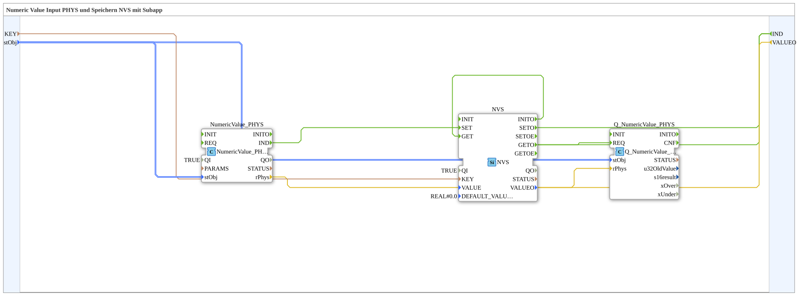

# Exercise_012f_sub: Numeric Value Input PHYS and Storage in Non-Volatile Memory (NVS) with Subapp

* * * * * * * * * *
## Introduction

This exercise demonstrates the processing of a numeric input value (raw value) into a physical value, its permanent storage in non-volatile memory (NVS), and the subsequent reading and output of the stored value. The functionality is encapsulated in a subapplication (SubApp).
## Function Blocks Used

The subapplication consists of three internal function blocks that together implement the desired functionality.

### Sub-Blocks: Exercise_012f_sub (SubAppType)

- **Type**: SubAppType
- **Internal Function Blocks Used**:
- **NumericValue_PHYS**: `isobus::UT::io::NumericValue::NumericValue_PHYS`
- Parameters: `QI` = `TRUE`
- Event Input: (none)
- Event Output: `IND`
- Data Input: `stObj` (Type `NumericObjectPool_S`)
- Data Output: `rPhys` (Type `REAL`)
- **Functionality**: Converts a raw numeric value defined via `stObj` The data is converted into a physical value (`rPhys`). Upon successful conversion, the event `IND` is triggered.

The data is converted into a physical value (`rPhys`). If the conversion is successful, the event `IND` is triggered.

... - **NVS**: `logiBUS::storage::esp32_nvs::NVS`

- Parameters: `QI` = `TRUE`, `DEFAULT_VALUE` = `REAL#0.0`
- Event inputs: `SET`, `GET`, `INIT`
- Event outputs: `SETO`, `GETO`, `INITO`
- Data inputs: `VALUE` (Type `REAL`) `KEY` (Type `STRING`)
- Data output: `VALUEO` (Type `REAL`)
- **Functionality**: Used to store and read a value in non-volatile memory (ESP32 NVS). The value is stored under a key (`KEY`). At `SET`, the value assigned to `VALUE` is stored; at `GET`, the stored value is output to `VALUEO`. The function block initializes automatically at startup (event `INITO`).
- **Q_NumericValue_PHYS**: `isobus::UT::Q::Q_NumericValue_PHYS`
- Parameters: none
- Event input: `REQ`
- Event output: (not connected)
- Data inputs: `stObj` (type `NumericObjectPool_S`), `rPhys` (type `REAL`)
- Data output: (not connected)
- **Functionality**: This quality block checks the consistency between the object pool (`stObj`) and the physical value (`rPhys`). In this network, it is triggered by reading the NVS (Numeric Value System) to verify the quality of the read value. Its output is not used further (for monitoring purposes only).

## Program Flow and Connections

### Event Flow

1. **Conversion and Storage**:
- The function block `NumericValue_PHYS` receives the configuration (`stObj`) and the raw value (implicitly via the input data of the subapp). After the conversion is complete, it generates the event `IND`.
- This event is forwarded to the input `SET` of the NVS function block. Simultaneously, the physical value (`NumericValue_PHYS.rPhys`) is available at the data input `NVS.VALUE`.
- The NVS stores the value under the key taken from the subapp input `KEY` and acknowledges it with `SETO`.

- The event `SETO` is passed to the subapp output `IND` (serving as confirmation for the caller).

2. **Initialization and First Read**:
- After the subapp starts, the event `NVS.INITO` is activated (by initializing the NVS block).
- This event is placed on the input `GET` of the NVS. This immediately reads the stored value.
- The read value appears at the data output `NVS.VALUEO`.
- The event `GETO` is simultaneously forwarded to two destinations:
- To the quality block `Q_NumericValue_PHYS.REQ`, which checks the data for plausibility (without feedback).
- To the subapp output `IND` (reconfirmation).
- The read value (`NVS.VALUEO`) is passed directly to the subapp data output `VALUEO` and to the data input `Q_NumericValue_PHYS.rPhys`.

### Data Connections

- `stObj` (Subapp input) → `NumericValue_PHYS.stObj` and `Q_NumericValue_PHYS.stObj`
- `KEY` (Subapp input) → `NVS.KEY`
- `NumericValue_PHYS.rPhys` → `NVS.VALUE`
- `NVS.VALUEO` → `VALUEO` (Subapp output) and `Q_NumericValue_PHYS.rPhys`

### Overview of Connections (not shown graphically)

[Subapp Eingänge] → [NumericValue_PHYS] → [NVS] → [Subapp Ausgänge]
↑          ↑
+-- stObj  +-- KEY
+-- Q_NumericValue_PHYS (Qualitätskontrolle)

### Learning Objectives

- Understanding the use of non-volatile memory (NVS) in 4diac.
- Familiarity with physical value conversion using `NumericValue_PHYS`.
- Integration of a quality block for monitoring.
- Development of a sub-app with multiple function blocks and event/data connections.

### Difficulty Level: Medium

### Prerequisites

- Basic operation of the 4diac IDE.
- Understanding of event and data flows in IEC 61499.
- Familiarity with the libraries used (`isobus`, `logiBUS`).

## Summary

The sub-app `Uebung_012f_sub` implements a compact unit for reading, converting, storing, and retrieving a numeric value in non-volatile memory. It combines physical conversion with persistent storage and optional quality control. The exercise teaches practical concepts of industrial automation with 4diac.

---

### 🌐 Related topic subpages on ms-muc-docs.de

* [🌐 Eclipse 4diac IDE & Color Reference on ms-muc-docs.de](https://www.ms-muc-docs.de/iec-61499/eclipse-4diac/)
* [🌐 ESP32 & ESP32-S3 DevKit on ms-muc-docs.de](https://www.ms-muc-docs.de/elektrotechnik/mikroelektronik/esp32/esp32-s3-devkit/)
