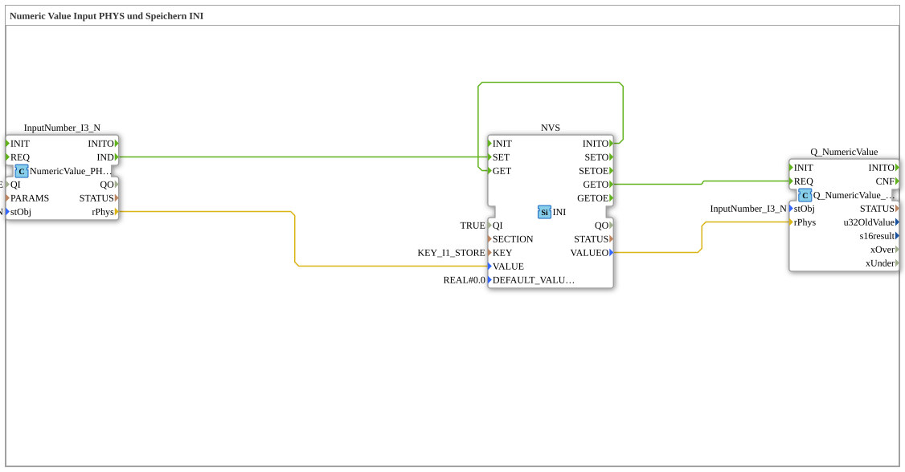

# Exercise_012g: Numeric Value Input PHYS and Storage via INI


* * * * * * * * * *
## Introduction
This exercise demonstrates the use of a physical numeric input (`NumericValue_PHYS`) in conjunction with persistent storage via the INI file format. The goal is to store an entered numeric value (e.g., from a sensor or user input) once and read it back as needed. The exercise introduces fundamental concepts of event handling, data flow chaining, and non-volatile data storage in 4diac.
The function blocks used are from the libraries `isobus::UT` and `eclipse4diac::storage`.

## Function Blocks (FBs) Used

### `InputNumber_I3`
- **Type**: `isobus::UT::io::NumericValue::NumericValue_PHYS`
- **Parameters**:
- `QI` = `TRUE`
- `stObj` = `InputNumber_I3`
- **Functionality**:

This function block represents a physical numeric input (e.g., an analog or digital input). When the input value changes, an event `IND` is triggered, and the current value is provided as a floating-point number at the output `rPhys`.

```
### `NVS`
- **Type**: `eclipse4diac::storage::INI`
- **Parameters**:
- `QI` = `TRUE`
- `KEY` = `KEY_I1_STORE`
- `DEFAULT_VALUE` = `REAL#0.0`
- **Functionality**:

This function block implements non-volatile storage using an INI file. A value can be stored and retrieved using the key `KEY_I1_STORE`.

- On the event `INIT`, it sends `INITO` and then automatically executes `GET`.
- On `SET`, the data value at `VALUE` is persistently stored.
- On `GET`, the stored value is output at `VALUEO` (if no value is stored, `DEFAULT_VALUE` is used).

...
### `Q_NumericValue`
- **Type**: `isobus::UT::Q::Q_NumericValue_PHYS`
- **Parameters**:
- `stObj` = `InputNumber_I3`
- **Functionality**:

This function block represents a physical output for numeric values. The event request `REQ` forwards the value present at `rPhys` to the physical output.

## Program Flow and Connections

1. **Initialization**

When the subapplication starts, the function block `NVS` is initialized with `INIT` and sends `INITO`. This event immediately triggers a `GET` instruction to load the last stored value. The read value is then transferred to the output block via the data connection `NVS.VALUEO → Q_NumericValue.rPhys`.

2. **Entering a New Value**

As soon as the input block `InputNumber_I3` registers a new numeric value (event `IND`), this value is transferred to the memory block via the data line `InputNumber_I3.rPhys → NVS.VALUE`. Simultaneously, `IND` triggers the event `SET` at the block `NVS`, thus persistently storing the new value.

2. **Entering a New Value**

As soon as the input block `InputNumber_I3` registers a new numeric value (event `IND`), this value is transferred to the memory block via the data line `InputNumber_I3.rPhys → NVS.VALUE`. 3. **Output of the Stored Value**

After the storage operation (triggered by `SET`), `NVS` internally executes `GET`. The event `GETO` is generated and forwarded to `Q_NumericValue.REQ`.

The previously stored value (now provided by `NVS.VALUEO`) is passed to the output module and physically output there.

## Summary

This exercise demonstrates a complete signal processing chain:

- Acquiring a numerical value via a physical input,
- Persistently storing it in an INI file,
- Outputting the stored value again to a physical output.

The event and data connections ensure that the last saved value is automatically displayed after power-up, and new input values are immediately saved and output. This pattern is suitable for applications such as saving setpoints or configuration parameters with simple persistent data storage.

---

### 🌐 Related topic subpages on ms-muc-docs.de
* [🌐 Eclipse 4diac IDE & Color Reference on ms-muc-docs.de](https://www.ms-muc-docs.de/iec-61499/eclipse-4diac/)

]
