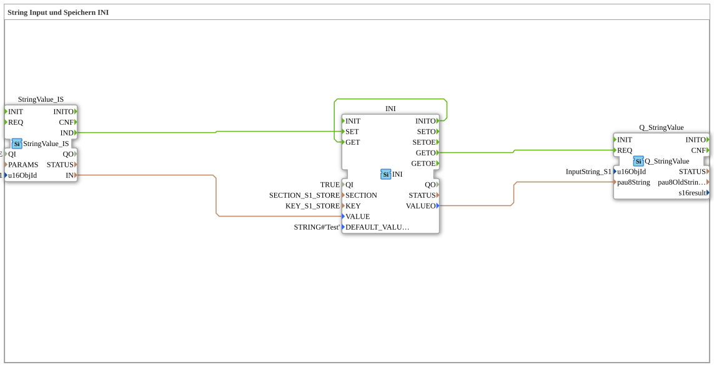

# Exercise_012j: String Input and Storage in INI

* * * * * * * * * *
## Introduction

This exercise demonstrates the processing and storage of a string value using an **INI function block**.
The goal is to persistently store a string read from a fieldbus object (ISOBUS) in an INI data structure and then retrieve it.

The configuration uses predefined constants for the memory location (`SECTION_S1_STORE`), the key (`KEY_S1_STORE`), and the object ID of the input string (`InputString_S1`).

## Function Blocks (FBs) Used

### FB: `StringValue_IS`

- **Type**: `isobus::UT::io::StringValue::StringValue_IS`
- **Parameters**:
- `QI` = `TRUE` (active)
- `u16ObjId` = `InputString_S1` (Object ID of the ISOBUS string object)
- **Events**:
- Event output: `IND` (triggered when a new string value is received)
- **Data**:
- Data output: `IN` (the read string value)
- **Functionality**:

Reads the string value from the specified The ISOBUS object ID (`InputString_S1`) is output via output `IN` and an event `IND`.

The system outputs the ISOBUS object ID (`InputString_S1`) and the output `IN`, as well as an event `IND`.

### FB: `INI`

- **Type**: `eclipse4diac::storage::INI`
- **Parameters**:
- `QI` = `TRUE` (active)
- `SECTION` = `SECTION_S1_STORE` (section in the INI file)
- `KEY` = `KEY_S1_STORE` (key within the section)
- `DEFAULT_VALUE` = `STRING#'Test'` (default value if no entry exists)
- **Events**:
- Event inputs: `SET` (stores the pending Value), `GET` (reads the stored value)
- Event outputs: `INITO` (after successful initialization), `GETO` (after successful read operation)
- **Data**:
- Data input: `VALUE` (the string to be stored)
- Data output: `VALUEO` (the read string)
- **Functionality**:

The function block manages a persistent string value in INI format. Upon the event `SET`, the pending `VALUE` is stored under the specified key and section. The event `GET` outputs the stored value to `VALUEO` and sends the event `GETO`. Upon initialization (`INITO`), `GET` is automatically executed.

The event `GET` is executed when the event occurs.
### FB: `Q_StringValue`

- **Type**: `isobus::UT::Q::Q_StringValue`
- **Parameters**:
- `u16ObjId` = `InputString_S1` (Object ID – not used directly here, but for context)
- **Events**:
- Event input: `REQ` (Request for output)
- **Data**:
- Data input: `pau8String` (the string to be output)
- **Functionality**:

Accepts a string and makes it available on the ISOBUS object with the specified ID (e.g., for display on a terminal).

## Program Flow and Connections

The program flow is divided into two phases: **Initialization** and **Cyclical Processing**.

### Event Connections

1. **Initialization**:

After successful initialization, the function block `INI` generates the event `INITO`. This is directly connected to the `GET` input of `INI`. This allows the stored value to be read immediately after startup.

2. **Reading the Stored Value**:

After the read operation, `INI` outputs the event `GETO`. This triggers the `REQ` input of `Q_StringValue`, so that the read string is passed to the ISOBUS object.

3. **Saving a New Value**:

When `StringValue_IS` receives a new string from the ISOBUS object, it sends the event `IND`. This event is connected to the `SET` input of `INI`, so the new value is saved.

### Data Connections

- The output `IN` of `StringValue_IS` is connected to the data input `VALUE` of `INI` – the read string is passed on for storage.
- The output `VALUEO` of `INI` is connected to the data input `pau8String` of `Q_StringValue` – the read string is then made available for output.

### Flowchart (Simplified)

1. **Start**: `INI` initializes → `INITO` → `GET` → reads stored value → `GETO` → `Q_StringValue.REQ` → outputs the stored string.
1. **Start**: `INI` initializes → `INITO` → `GET` → reads stored value → `GETO` → `Q_StringValue.REQ` → outputs stored string. 2. **New Input**: `StringValue_IS` receives a new string → `IND` → `INI.SET` → stores the new value.
3. After another input from `GET` (e.g., via a cyclic trigger), the currently stored value is output.

## Summary

Exercise `Uebung_012j` teaches how to:

- Read a string value from an ISOBUS object (`StringValue_IS`)
- Persistently store the value using the `INI` function block (section, key, default value)
- Return the stored value to an ISOBUS object (`Q_StringValue`)

The use of constants (`SECTION_S1_STORE`, `KEY_S1_STORE`, `InputString_S1`) ensures a clear separation between configuration and logic. The process demonstrates a typical initialization and update strategy for decentralized control systems with memory requirements.

---

### 🌐 Related topic subpages on ms-muc-docs.de

* [🌐 Eclipse 4diac IDE & Color Reference on ms-muc-docs.de](https://www.ms-muc-docs.de/iec-61499/eclipse-4diac/)

]
