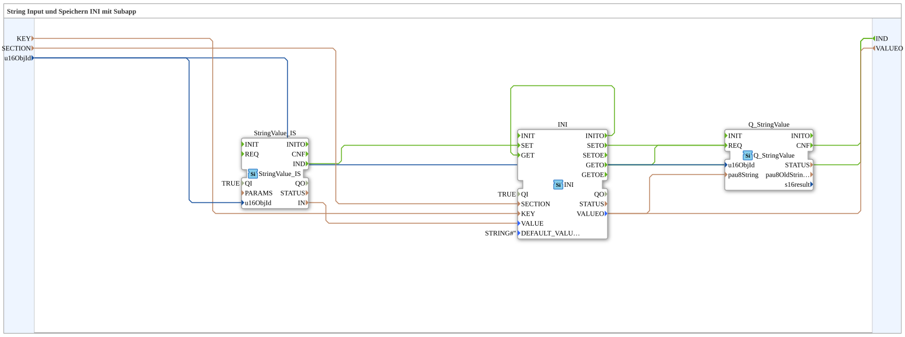

# Exercise_012k_sub: String Input and Storage in INI with Subapp

* * * * * * * * * *
## Introduction
This exercise demonstrates the use of a subapplication to process a string input and store it in an INI structure. The subapp accesses a string value (e.g., from a CAN bus), stores it under a key and a section (SECTION), and outputs the stored value via an output and a queue block. The object ID (u16ObjId) is used to identify the data object.
## Function Blocks (FBs) Used

The subapplication consists of three internal function blocks:

- **StringValue_IS** (Type: `isobus::UT::io::StringValue::StringValue_IS`)

Reads a string value from an external interface (e.g., ISOBUS). Activated when a new string is available.

- **INI** (Type: `eclipse4diac::storage::INI`)

Stores a string value in an INI-like data structure under a given key (KEY) in a section (SECTION). Contains initialization logic and can set and retrieve values.

- **Q_StringValue** (Type: `isobus::UT::Q::Q_StringValue`)

A queue block for string values. It receives the stored string and the object ID and passes it on when requested (e.g., for output to the bus).

| Block Name | Type | Parameters / Remarks |

|-------------------|--------------------------------------------------------|--------------------------------------|

| StringValue_IS | `isobus::UT::io::StringValue::StringValue_IS` | QI = TRUE |

| INI | `eclipse4diac::storage::INI` | QI = TRUE, DEFAULT_VALUE = '' |

| Q_StringValue | `isobus::UT::Q::Q_StringValue` | no additional parameters |

### Sub-Blocks

No further sub-blocks are defined; the function blocks listed above are the only ones within the sub-application.

## Program Flow and Connections

The sub-application has the following interfaces:

- **Inputs**:
- `KEY` (STRING): The key under which the value is stored.
- `SECTION` (STRING): The section of the INI structure.
- `u16ObjId` (UINT): Object ID, default value = ID_NULL (from the imported namespace `isobus::UT::Q::const::IDs`).
- **Outputs**:
- `VALUEO` (STRING): The value read from the INI file.
- `IND` (Event): Signals that a new value has been processed.

**Process:**

1. **Initialization**: After the subapplication starts, the event `INITO` of the INI block is triggered on the first run. This is internally connected to the input `GET`, so the INI block immediately retrieves the current value for the given key.

2. **Input Processing**:

- The event output `IND` of the `StringValue_IS` block triggers the `SET` input of the INI block as soon as a new string arrives.
- Simultaneously, the string value from `StringValue_IS.IN` is passed to the `VALUE` input of the INI block.
- The parameters `KEY`, `SECTION`, and `u16ObjId` are passed directly from the SubApp inputs to the corresponding function blocks (`KEY` → INI.KEY, `SECTION` → INI.SECTION, `u16ObjId` → StringValue_IS.u16ObjId and Q_StringValue.u16ObjId).

3. **Output**:

- After successful saving (or retrieval), the INI function block returns the event `SETO` and/or `GETO`.
- The `SETO` event is passed to the SubApp output `IND`.
- The `GETO` event triggers, firstly, the `REQ` input of the `Q_StringValue` block, which passes the current string (from INI.VALUEO) and the object ID to the queue, and secondly, the SubApp output `IND`.

`` **Summary of Connections**:

- **Event Connections**:
- `StringValue_IS.IND` → `INI.SET`
- `INI.SETO` → `IND` (SubApp output)
- `INI.GETO` → `Q_StringValue.REQ` and → `IND` (SubApp output)
- `INI.INITO` → `INI.GET` (Internal trigger loop)
- **Data Connections**:
- `StringValue_IS.IN` → `INI.VALUE`
- `u16ObjId` → `Q_StringValue.u16ObjId`
- `KEY` → `INI.KEY`
- `INI.VALUEO` → `Q_StringValue.pau8String` and → `VALUEO` (SubApp output)
- `u16ObjId` → `StringValue_IS.u16ObjId`
- `SECTION` → `INI.SECTION`

The subapplication thus implements a closed loop: Every newly arriving string is stored, and simultaneously the stored value is made available (both via `Q_StringValue` and directly via the output).

## Summary

Exercise `Uebung_012k_sub` demonstrates how to construct a subapplication from several predefined function blocks to store and output a string input in an INI-like structure. By combining event and data connections, a robust processing chain is created that integrates initialization, storage, and retrieval. This is a typical pattern for persistent data management in automation systems based on the IEC 61499 standard.

---

### 🌐 Related topic subpages on ms-muc-docs.de
* [🌐 Eclipse 4diac IDE & color reference on ms-muc-docs.de ](https://www.ms-muc-docs.de/iec-61499/eclipse-4diac/)

]
