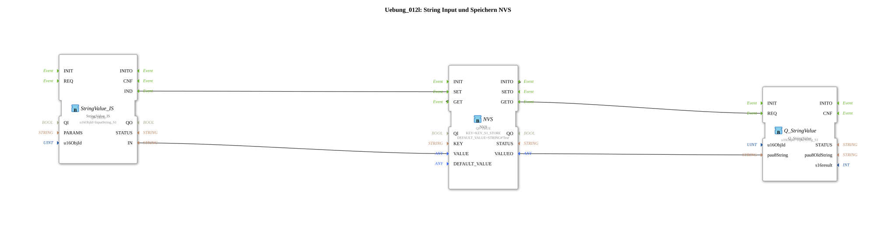

# Exercise_012l: String Input and Storage in NVS



* * * * * * * * * *

## Introduction

This exercise demonstrates reading a string from an ISOBUS variable (InputString_S1) and storing this value in the non-volatile memory (NVS) of an ESP32. When the application starts, the last stored string is automatically loaded from the NVS and written back to the corresponding ISOBUS variable. This ensures the value is retained even after a restart.


``` ## Function Blocks (FBs) Used

### StringValue_IS
- **Type**: `isobus::UT::io::StringValue::StringValue_IS`
- **Parameters**:

- `QI` = `TRUE`

- `u16ObjId` = `InputString_S1`
- **Functionality**: The function block receives the current string value of the ISOBUS object variable `InputString_S1`. Whenever this value changes (e.g., due to input at the terminal), a signal is generated at the event output `IND`, and the new string is provided at the data output `IN`.


### NVS

- **Type**: `logiBUS::storage::esp32_nvs::NVS`

- **Parameters**:

- `QI` = `TRUE`

- `KEY` = `KEY_S1_STORE`

- `DEFAULT_VALUE` = `STRING#'Test'`

- **Functionality**: This module manages the non-volatile memory on the ESP32.

- Upon an event at `SET`, it saves the string associated with `VALUE` under the key `KEY_S1_STORE`.

- Upon an event at `GET`, it loads the stored string and makes it available at the data output `VALUEO`.

- After initialization (`INITO`), it automatically triggers `GET`.

### Q_StringValue
- **Type**: `isobus::UT::Q::Q_StringValue`
- **Parameters**:

- `u16ObjId` = `InputString_S1`
- **Functionality**: This function block writes ("qualifies") a received string back into the ISOBUS variable `InputString_S1`. An event at `REQ` inherits the value from `pau8String` and updates the ISOBUS variable.

## Program Flow and Connections

### Initialization (Start)

1. After the controller starts, the `NVS` block receives the event `INITO`.

2. This event is internally linked to the output `GET` (visible in the XML as `Connection Source="NVS.INITO" Destination="NVS.GET" …`). This immediately triggers a read operation.

3. The `NVS` block loads the string stored at `KEY_S1_STORE` (or the default value `"Test"` if no value has been stored yet) and outputs it at `VALUEO`.

4. Simultaneously, the `NVS` block generates an event at output `GETO`, which is connected to the `REQ` input of `Q_StringValue`.


The ...9qz block loads the string stored at `KEY_S1_STORE` (or the default value `"Test"` if no value has been stored yet) and outputs it at output `VALUEO`.

The `NVS` block simultaneously generates an event at output `GETO`, which is connected to the `REQ` input of `Q_StringValue`. 5. `Q_StringValue` takes the string from `NVS.VALUEO` (via `pau8String`) and writes it to the ISOBUS variable `InputString_S1`.

### Changing the String (e.g., via terminal input)

1. As soon as the value of `InputString_S1` is changed externally (e.g., via an operator terminal), `StringValue_IS` generates an event at `IND`.

2. This event is connected to the `SET` input of the `NVS` module.


### ...### 3. ``NVS`` stores the current string (from ``StringValue_IS.IN`` via the data connection to ``NVS.VALUE``) under the key ``KEY_S1_STORE``.

4. **Note:** After saving, ``Q_StringValue`` is **not** automatically updated. The value is only written back to the ISOBUS variable at startup. This is intentional, as the value is already visible in the terminal.


``NVS``. ### Data Connections Overview

- **Events**:

- `NVS.INITO` → `NVS.GET` (initial read operation)

- `NVS.GETO` → `Q_StringValue.REQ` (output of the loaded string)

- `StringValue_IS.IND` → `NVS.SET` (saving on change)

- **Data**:

- `NVS.VALUEO` → `Q_StringValue.pau8String` (string to be loaded)

- `StringValue_IS.IN` → `NVS.VALUE` (string to be saved)

### Important Constants

- **`KEY_S1_STORE`**: The NVS key under which the string is stored.

- **`InputString_S1`**: The ID of the ISOBUS string variable that serves as the source and destination.

## Learning Objectives

- Understanding non-volatile storage (NVS) on ESP32 systems.

- Working with ISOBUS string variables in 4diac.

- Event-driven processes: initialization and reactive storage.

- Using predefined constants (keys, object IDs).

## Required Prior Knowledge
- Basic operation of the 4diac IDE.

- Fundamentals of ISOBUS communication (object IDs, reading/writing values).

- Basic understanding of event-driven systems.


## Summary

Exercise `Uebung_012l` demonstrates how to write an ISOBUS string to the NVS memory of the ESP32 and read it back upon system startup. The value is retained permanently, even after a restart or power failure. The application consists of three function blocks that interact via event and data connections and demonstrates a typical use case for persistent variable access in agricultural automation.

---

### 🌐 Related topic subpages on ms-muc-docs.de

* [🌐 Eclipse 4diac IDE & Color Reference on ms-muc-docs.de](https://www.ms-muc-docs.de/iec-61499/eclipse-4diac/)

* [🌐 ESP32 & ESP32-S3 DevKit on ms-muc-docs.de](https://www.ms-muc-docs.de/elektrotechnik/mikroelektronik/esp32/esp32-s3-devkit/)


```