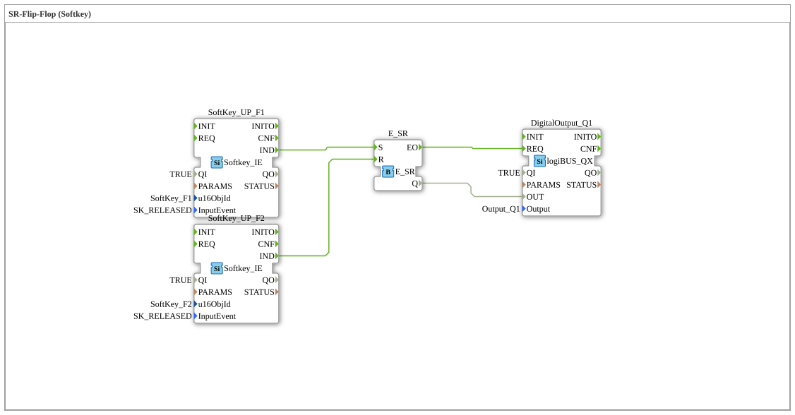

# Exercise_013: SR Flip-Flop (Softkey)
[](https://notebooklm.google.com/notebook/a6872e59-1dfc-4132-a118-aff1bc7bc944)
This article describes the logiBUS® exercise `Uebung_013`. It demonstrates the implementation of a memory function that is fully controlled via the ISOBUS terminal.
Exercise_013: SR Flip-Flop (Softkey)
[](https://notebooklm.google.com/notebook/a6872e59-1dfc-4132-a118-aff1bc7bc944)

This article describes the logiBUS® exercise `Uebung_013`. It demonstrates the implementation of a memory function that is operated entirely via the ISOBUS terminal.

``` ## 🎧 Podcast



* [The three timers of DIN EN 61131-3 decoded – TP, TON & TOF explained precisely]
* [DIN EN 61131-3 vs. 61499-1: Your guide through the standards of industrial automation]
* [DIN EN 61131-3: The heart of agricultural and construction machinery mechatronics and the leap into the future with OB]
* [FB_TOF and E_TOF: Delay timers in IEC 61131-3 and 61499]
* [IEC 61499 vs. 61131: Do we need a new standard for IIoT? Analysis of a Heated Debate on Distributed Intelligence

----

## Objective of the Exercise

Implementation of an on/off switch with separate virtual buttons.

-----

## Description and Components

[cite_start]The subapplication `Uebung_013.SUB` uses two softkeys to control an SR flip-flop[cite: 1].

### Function Blocks (FBs)
* **`SoftKey_UP_F1`**: Triggers the set input (`S`) on release.
* **`SoftKey_UP_F2`**: Triggers the reset input (`R`) on release.
* **`E_SR`**: The memory module.
* **`DigitalOutput_Q1`**: The hardware output.

----

## Functionality
* A click on **F1** activates the function.
* A click on **F2** deactivates the function.

The use of `SK_RELEASED` ensures a stable user experience on the touchscreen. Since two separate buttons are used, the system status is always clearly controllable for the operator.

-----

## Application Example

**Activating an attachment**:

The terminal displays two clear symbols: a green check mark (`F1`) for "System Active" and a red cross (`F2`) for "System Deactivated". The memory in the controller ensures that the selected operating mode is retained until the other button is pressed.