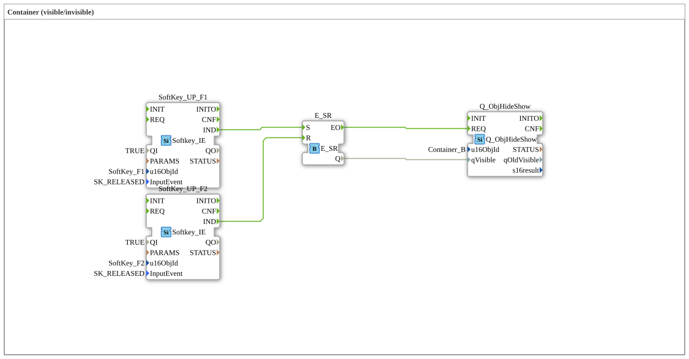

# Exercise_014: Containers (visible/invisible)

[(https://notebooklm.google.com/notebook/a6872e59-1dfc-4132-a118-aff1bc7bc944)
This article describes the logiBUS® exercise `Uebung_014`. It demonstrates how to dynamically change the user interface of the ISOBUS terminal by making entire groups of objects (containers) visible or invisible.
## 🎧 Podcast

- [4diac IDE: Your Open-Source Toolkit for Distributed Industrial Automation according to IEC 61499](https://podcasters.spotify.com/pod/show/eclipse-4diac-de/episodes/4diac-IDE-Dein-Open-Source-Werkzeugkasten-fr-verteilte-Industrieautomatisierung-nach-IEC-61499-e36821e)
- [4diac IDE: How the IEC 61499 Standard is Revolutionizing Industrial Automation](https://podcasters.spotify.com/pod/show/eclipse-4diac-de/episodes/4diac-IDE-Wie-der-IEC-61499-Standard-die-Industrieautomatisierung-revolutioniert-e36756a)
- [Eclipse 4diac FORTE: Understanding IEC 61499 – The LEGO® Building Kit for Your Industry 4.0 Control System](https://podcasters.spotify.com/pod/show/eclipse-4diac-de/episodes/Eclipse-4diac-FORTE-IEC-61499-verstehen--Der-LEGO-Baukasten-fr-Ihre-Industrie-4-0-Steuerung-e3682kc)
- [Eclipse 4diac: Open-Source Automation for Industry and Research according to IEC 61499](https://podcasters.spotify.com/pod/show/eclipse-4diac-de/episodes/Eclipse-4diac-Open-Source-Automatisierung-fr-Industrie-und-Forschung-nach-IEC-61499-e38b4na)
- [IEC 61499: The Future of Industrial Automation and Distributed System ](https://podcasters.spotify.com/pod/show/eclipse-4diac-de/episodes/IEC-61499-Die-Zukunft-der-industriellen-Automatisierung-und-verteilten-Systeme-e369739)

----

## Exercise Objective

Using the function block `Q_ObjHideShow` to control the visibility of ISOBUS objects. This allows the creation of context-sensitive interfaces that display only the information relevant to the current operating state.

-----

## Description and Components

[cite_start]The subapplication `Uebung_014.SUB` uses two softkeys to set or clear a memory location whose state controls the visibility of a container[cite: 1].

### Function Blocks (FBs)

- **`SoftKey_UP_F1` & `F2`**: Terminal input (On/Off).
- **`E_SR`**: Memory for the visibility status.
- **`Q_ObjHideShow`**: The ISOBUS output block. [cite_start]It controls the "Visibility" property of the object with the ID `Container_B`[cite: 1].

-----

## Functionality

1. Pressing **F1** sets the memory to `TRUE`.
2. Pressing **F2** sets the memory to `FALSE`.
3. The respective event (`EO`) triggers the `REQ` input of `Q_ObjHideShow`.
4. The block transmits the state of `qVisible` to the terminal.
5. All objects located in the ISOBUS pool within `Container_B` now appear or disappear simultaneously on the screen.

-----

## Application Example

**Optional Features**:

A machine can be ordered with or without a weighing system. The weighing display is grouped in a container within the software. Depending on the configuration (or button press), this entire area is shown or hidden, preventing the operator from being distracted by inactive fields.

---

### 🌐 Related topic subpages on ms-muc-docs.de

- [🌐 Eclipse 4diac IDE & Color Reference on ms-muc-docs.de](https://www.ms-muc-docs.de/iec-61499/eclipse-4diac/)
