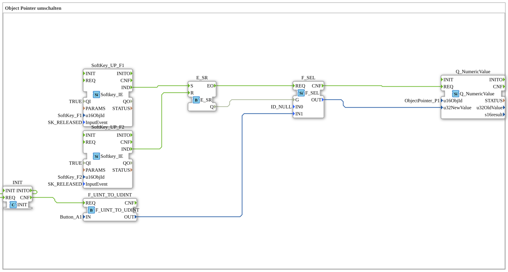

# Exercise_015: Switching Object Pointers

This article describes the logiBUS® exercise `Uebung_015`. It demonstrates an advanced ISOBUS technique: switching object pointers to dynamically exchange screen content.
Exercise_015: Switching Object Pointers

This article describes the logiBUS® exercise `Uebung_015`. It demonstrates an advanced ISOBUS technique: switching object pointers to dynamically exchange screen content.]
## 🎧 Podcast

* [As an agricultural machinery specialist through hell: How Lanz-Wery survived war, occupation, and hyperinflation – Insights into original business reports 1915-1922](https://podcasters.spotify.com/pod/show/ms-muc-lama/episodes/Als-Landtechnik-Spezialist-durch-die-Hlle-Wie-Lanz-Wery-Krieg--Besatzung-und-Hyperinflation-berlebte--Einblicke-in-Original-Geschftsberichte-1915-1922-e39athj)
* [Hannes' Turbo Corn: How a farmer processes 15,000 tons of grain corn with a wood chip recycling system and tower dryer](https://podcasters.spotify.com/pod/show/ms-muc-lama/episodes/Hannes-Turbo-Mais-Wie-ein-Landwirt-mit-Hackschnitzel-Kreislauf-und-Turmtrockner-15-000-Tonnen-Krnermais-verarbeitet-e3a5e0o)
* [JBC Soldering Tips C470 vs. C245 vs. C210 vs. C115: Which tip is the all-rounder and when do you need the nano specialist?](https://podcasters.spotify.com/pod/show/ms-muc-lama/episodes/JBC-Ltspitzen-C470-vs--C245-vs--C210-vs--C115-Welche-Spitze-ist-der-Allrounder-und-wann-brauchst-du-den-Nano-Spezialisten-e39ak58)
* [Schlüter 1500 Special: Turbo toxicity, 40 years, and the soul of a Kraftprotzes](https://podcasters.spotify.com/pod/show/ms-muc-lama/episodes/Schlter-1500-Spezial-Turbo-Giftigkeit--40-Jahre-und-die-Seele-eines-Kraftprotzes-e39au2l)

----

## Exercise Objective

Learn how to use `Object Pointer` objects. A pointer is a placeholder on the screen to which the ID of another object can be assigned at runtime. This is more efficient than hiding many individual objects.

-----

## Description and Components

[cite_start]In `Uebung_015.SUB`, an object pointer (`ObjectPointer_P1`) is toggled between a button (`Button_A1`) and an empty state (`ID_NULL`)[cite: 1].

### Function Blocks (FBs)

* **`SoftKey_UP_F1` & `F2`**: Control the selection.
* **`F_SEL`**: A selection block. [cite_start]Depending on the input `G` (from memory `E_SR`), it outputs either the value `ID_NULL` (0) or the object ID of `Button_A1`[cite: 1].
* **`Q_NumericValue`**: Used here for a different purpose, to send the ID to the pointer (since a pointer update technically involves sending a new ID to the pointer's object ID).
* -----

## Functionality

1. User presses **F1** ➡️ Memory is set to `TRUE` ➡️ `F_SEL` cycles through `Button_A1`.
2. The ID of `Button_A1` is sent to `ObjectPointer_P1`.
3. The button `A1` suddenly appears on the screen at the pointer's position.
4. User presses **F2** ➡️ ID `0` is sent ➡️ The screen space is cleared again.

-----

## Application Example

**Context-Sensitive Buttons**:

A central location on the terminal should display different functions depending on the operating mode (e.g., a road icon in "Transport" mode, a plow icon in "Field" mode). Instead of layering and hiding two buttons, a pointer is used that refers to one image object or the other depending on the mode.

--

### 🌐 Related topic subpages on ms-muc-docs.de

* [🌐 Interactive JBC Soldering Tip Guide & Infographic on ms-muc-docs.de](https://www.ms-muc-docs.de/elektrotechnik/werkzeug/lötkolben/jbc-lötspitzen-übersicht/)

]
