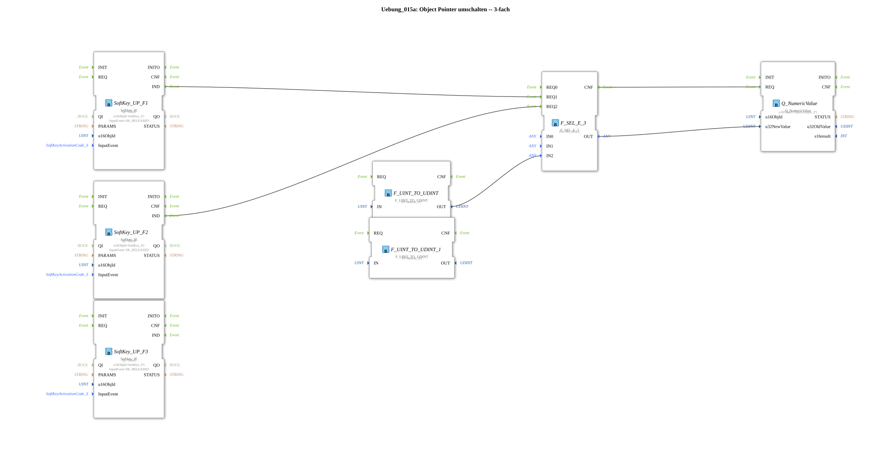

# Exercise_015a: Switching Object Pointers -- 3-Way

This article describes the logiBUS® exercise `Uebung_015a`.
----
## Overview
[cite_start]This exercise extends the pointer concept from exercise 015 to three states using the function block `F_SEL_E_3`[cite: 1].

[cite_start] Three softkeys (`F1`, `F2`, `F3`) allow the user to choose what is displayed at a specific location on the screen:

1. Nothing (`ID_NULL`)

2. Button (`Button_A1`)

3. Button (`Button_A2`)

This demonstrates the flexibility of pointers in creating dynamic menu structures or toggleable information areas.

