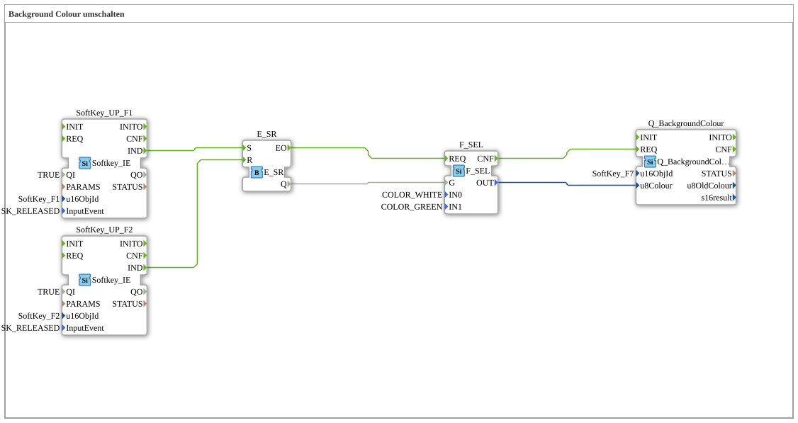

# Exercise_016: Switching Background Color

This article describes the logiBUS® exercise `Uebung_016`. It demonstrates how to change the background color of objects (e.g., softkeys) at runtime to visualize their states.
## 🎧 Podcast

* [ESP32-S3-DevKitC-1 Document Analysis: The Memory Monster (32MB Flash/16MB PSRAM) and the Power of Dual USB Ports ](https://podcasters.spotify.com/pod/show/ms-muc-lama/episodes/ESP32-S3-DevKitC-1-Doku-Analyse-Das-Speicher-Monster-32MB-Flash16MB-PSRAM-und-die-Macht-der-Dual-USB-Ports-e39hamt)

----

## Goal of the Exercise

Using the function block `Q_BackgroundColour`. This is an alternative to color changes in sub-applications (as in Exercise 010c) and allows the explicit selection of colors from the ISOBUS palette.

-----

## Description and Components

[cite_start]The sub-application `Uebung_016.SUB` toggles the color of the softkey `F7` based on the selections made via `F1` and `F2`[cite: 1].

### Function Blocks (FBs)
* **`F_SEL`**: Selects between two color constants.
* **`Q_BackgroundColour`**: The initial function block. [cite_start]It sets the background color for the object `SoftKey_F7`[cite: 1].

-----

## Functionality
* When the memory is set by **F1**, `F_SEL` returns the value `COLOR_GREEN`.
* When it is cleared by **F2**, `F_SEL` returns the value `COLOR_WHITE`.
* The result is sent to `Q_BackgroundColour`, which sends the corresponding ISOBUS command ("Change Background Colour") to the terminal.

The softkey `F7` (which in this exercise has no logic of its own, but only serves as an indicator) now toggles between green and white.

-----

## Application Example

**Status Indicator**:

A sensor monitors a fill level. If everything is within the green range, an indicator on the terminal lights up green. When the level reaches a critical threshold, the indicator switches to yellow or red to visually warn the operator.

---

### 🌐 Related topic subpages on ms-muc-docs.de
* [🌐 ESP32 & ESP32-S3 DevKit on ms-muc-docs.de](https://www.ms-muc-docs.de/elektrotechnik/mikroelektronik/esp32/esp32-s3-devkit/)

]