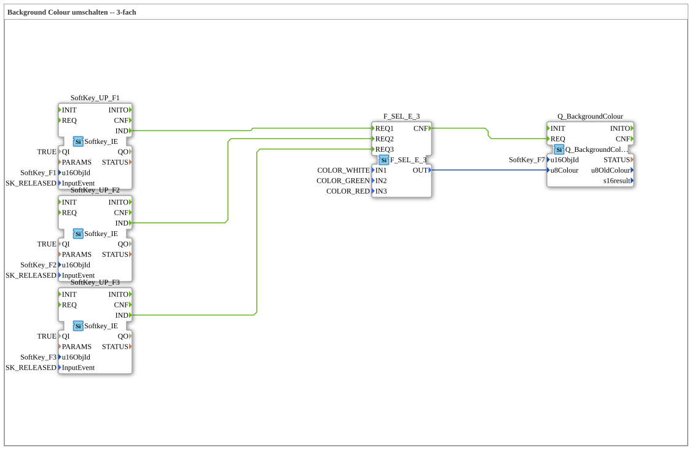

# Exercise_016a: Switching Background Color -- 3-way

This article describes the logiBUS® exercise `Uebung_016a`.
----
## Overview

[cite_start]This exercise extends the color switching concept to three colors using `F_SEL_E_3`[cite: 1]. Using three softkeys, the background of an object (`SoftKey_F7`) can be directly set to **White**, **Green**, or **Red**. This forms the basis for more complex traffic light logic or differentiated status messages on the Universal Terminal.