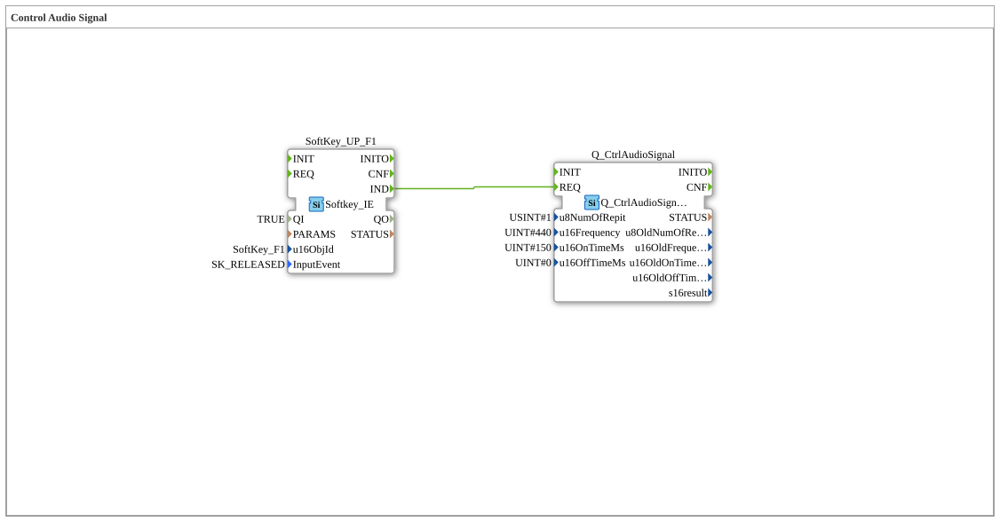

# Exercise_017: Control Audio Signal

[(https://notebooklm.google.com/notebook/a6872e59-1dfc-4132-a118-aff1bc7bc944)
This article describes the logiBUS® exercise `Uebung_017`. This exercise demonstrates how to control the internal buzzer of the ISOBUS terminal to provide audible feedback.
## 🎧 Podcast

- "Store Version" – Your Key to Managing Object Data Pools in Non-Volatile Virtual Terminal Memory (ISO 11783-6) ](https://podcasters.spotify.com/pod/show/isobus-vt-objects/episodes/Store-Version--Dein-Schlssel-zur-Verwaltung-von-Objektdatenpools-im-nichtflchtigen-VT-Speicher-ISO-11783-6-e36vfh0)
- ISO 11783-6: Understanding Softkeys and the Virtual Terminal – Your Key to Agricultural Machinery Mechatronics ](https://podcasters.spotify.com/pod/show/isobus-vt-objects/episodes/ISO-11783-6-Softkeys-und-das-Virtual-Terminal-verstehen--Dein-Schlssel-zur-Landmaschinen-Mechatronik-e36a8b0)
- ISOBUS Scaling: When the Tractor Screen Doesn't Fit – An Introduction to ISO 11783-6 ](https://podcasters.spotify.com/pod/show/isobus-vt-objects/episodes/ISOBUS-Skalierung-Wenn-der-Ackerschlepper-Bildschirm-nicht-passt--Eine-Einfhrung-in-ISO-11783-6-e36a8q6)
- ISOBUS Bar Graph: The Output Linear Bar Graph Object of ISO 11783-6 Decoded ](https://podcasters.spotify.com/pod/show/isobus-vt-objects/episodes/ISOBUS-Balkendiagramm-Das-Output-Linear-Bar-Graph-Objekt-der-ISO-11783-6-entschlsselt-e36l0v2)
- ISOBUS User Interfaces: When Buttons and Main Display Scale Differently – ISO 11783-6 decrypted](https://podcasters.spotify.com/pod/show/isobus-vt-objects/episodes/ISOBUS-Bedienoberflchen-Wenn-Tasten-und-Hauptanzeige-unterschiedlich-skalieren--ISO-11783-6-entschlsselt-e36a8n8)

----

## Objective of the Exercise

Using the function block `Q_CtrlAudioSignal`. This demonstrates how an event (here, a softkey click) triggers audio output at the terminal with a specific frequency and duration.

-----

## Description and Components

[cite_start]The subapplication `Uebung_017.SUB` triggers an audio signal when a softkey is pressed[cite: 1].

### Function Blocks (FBs)

- **`SoftKey_UP_F1`**: The trigger.
- **`Q_CtrlAudioSignal`**: The ISOBUS output block for audio.
- **Parameters**:
- `u16Frequency`: Pitch in Hertz (here 440 Hz = concert pitch A).
- `u16OnTimeMs`: Duration of the tone (150 ms).
- `u8NumOfRepit`: Number of repetitions (1).

-----

## Functionality

The chain is purely event-based:

A click (and release) of the softkey **F1** triggers a `IND` event. This goes directly to the `REQ` input of the audio module. The terminal then receives the command to emit a single beep for 150 ms at 440 Hz.

## Application Example

**Key Tone Confirmation**:

Each keystroke on the terminal should be confirmed by a short, discreet beep. This provides the operator with audible feedback of successful input, even if they are not looking directly at the screen.
