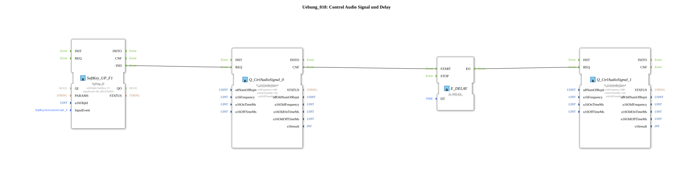

# Exercise_018: Control Audio Signal and Delay

[(https://notebooklm.google.com/notebook/a6872e59-1dfc-4132-a118-aff1bc7bc944)
This article describes the logiBUS® exercise `Uebung_018`. Here, the audio output is extended to create time-delayed tone sequences.
Exercise_018: Control Audio Signal and Delay
[(https://notebooklm.google.com/notebook/a6872e59-1dfc-4132-a118-aff1bc7bc944)

This article describes the logiBUS® exercise `Uebung_018`. Here, the audio output is extended to create time-delayed tone sequences.]

[qzmsdocs0000001qz]
## 📺 Video

- [The 1863 Catalog](https://www.youtube.com/watch?v=fk7tIjl2pTk)

## 🎧 Podcast

- [Agricultural Revolution of 1883: How Max Eyth Modernized England's Agriculture](https://podcasters.spotify.com/pod/show/ms-muc-lama/episodes/Agrar-Revolution-1883-Wie-Max-Eyth-Englands-Landwirtschaft-modernisierte-e36faae)
- [Cider as a Universal Weapon and the Nitrogen Revolution: Middle Franconian Agriculture in 1892 Under the Newspaper Microscope](https://podcasters.spotify.com/pod/show/ms-muc-lama/episodes/Apfelwein-Allzweckwaffe-und-Stickstoff-Revolution-Die-Landwirtschaft-Mittelfrankens-1892-im-Zeitungs-Check-e39auu2)
- [The 1863 Technology Panorama: Lanz & Co. and the Revolution of German Agriculture Through Import, Innovation, and Guano](https://podcasters.spotify.com/pod/show/ms-muc-lama/episodes/Das-Technologie-Panorama-von-1863-Lanz--Comp--und-die-Revolution-der-deutschen-Landwirtschaft-durch-Import--Innovation-und-Guano-e39auqa)

----

## Objective of the Exercise

Learning event delay (`E_DELAY`) for creating sequences. This section demonstrates how to play two tones with different frequencies sequentially.

-----

## Description and Components

[cite_start]In `Uebung_018.SUB`, two audio function blocks are chained together using a timer.[cite: 1]

### Function Blocks (FBs)

- **`Q_CtrlAudioSignal_0`**: First tone (440 Hz).
- **`E_DELAY`**: A delay function block.[cite_start]After an event at input `START`, it waits for `DT` (here 250 ms) before passing the event on to output `EO`.[cite: 1]

- **`Q_CtrlAudioSignal_1`**: Second tone (880 Hz - one octave higher).

-----

## Functionality

1. A softkey click starts tone 0.
2. Simultaneously with the start of the first tone (or after its confirmation `CNF`), the timer `E_DELAY` is started.
3. The timer counts down while the first tone sounds (150 ms) and during the short pause afterward.
4. After 250 ms, the timer fires and starts the second (higher) tone.

The result is a two-stage "Didi" signal.

----

## Application Example

**Differentiated Warning Signals**:

A short "beep" is normal information. A "beep-beep" (e.g., a low tone followed by a high tone) signals the end of a process. A reversed signal (high to low) could provide an audible accompaniment to an error message.
