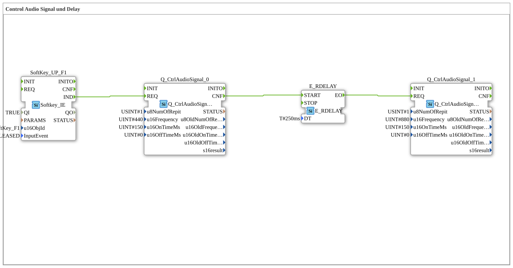

Here is the documentation for exercise `Uebung_018a` in the required format.

# Exercise_018a: Control Audio Signal and Delay

* * * * * * * * * *
This exercise demonstrates the control of audio signals in an ISOBUS Universal Terminal environment in combination with a time delay. The goal is to play a sequence of two different tones, separated by a short pause, when a softkey is released. This illustrates event processing and the use of delay blocks for sequencing actions.

In this sub-application, various function blocks are instantiated and interconnected to implement the desired logic.

### Sub-modules

## Function Blocks Used (FBs)

## Introduction

#### **SoftKey_UP_F1**

- **Type**: `isobus::UT::io::Softkey::Softkey_IE`
- **Description**: This module monitors input at the Universal Terminal (UT) for a specific softkey.
- **Type**: `isobus::UT::io::Softkey::Softkey_IE`
- **Description**: This module monitors input at the Universal Terminal (UT) for a specific softkey. ... - **Configuration**:
- **Parameter**: `QI` = `TRUE` (Activates the function block)
- **Parameter**: `u16ObjId` = `SoftKey_F1` (F1 key identifier)
- **Parameter**: `InputEvent` = `SK_RELEASED` (Reacts to key release)
- **Event Output**: `IND` (Indicates that the event has occurred)

#### **Q_CtrlAudioSignal_0**

- **Type**: `isobus::UT::Q::Q_CtrlAudioSignal`
- **Description**: Generates the first acoustic signal (lower tone).
- **Configuration**:
- **Parameters**: `u8NumOfRepit` = `1` (One-time playback)
- **Parameters**: `u16Frequency` = `440` (Frequency in Hz - Concert pitch A)
- **Parameters**: `u16OnTimeMs` = `150` (Duration of the tone in milliseconds)
- **Parameters**: `u16OffTimeMs` = `0`
- **Event Input**: `REQ` (Starts the tone output)
- **Event Output**: `CNF` (Confirms the (Processing)

#### **E_RDELAY**

- **Type**: `iec61499::events::E_RDELAY`
- **Description**: A delay block that postpones the forwarding of an event by a defined time.
- **Configuration**:
- **Parameters**: `DT` = `T#250ms` (Delay time of 250 milliseconds)
- **Event Input**: `START` (Starts the timer)
- **Event Output**: `EO` (Fires after the time has elapsed)

#### **Q_CtrlAudioSignal_1**

- **Type**: `isobus::UT::Q::Q_CtrlAudioSignal`
- **Description**: Generates the second audible signal (higher pitch).
- **Configuration**:
- **Parameter**: `u8NumOfRepit` = `1` (One-time playback)
- **Parameter**: `u16Frequency` = `880` (Frequency in Hz - one octave higher)
- **Parameter**: `u16OnTimeMs` = `150` (Duration of the tone in milliseconds)
- **Parameter**: `u16OffTimeMs` = `0`
- **Event Input**: `REQ` (Starts the sound output)

The exercise is structured sequentially and is started by user interaction:

1. **Start:** The user releases the F1 softkey on the terminal. This is detected by the function block `SoftKey_UP_F1`.
2. **First Tone:** The softkey event `IND` triggers the input `REQ` of `Q_CtrlAudioSignal_0`. A tone at 440 Hz is played for 150 ms.
3. **Delay:** Once the command for the first tone has been processed (`CNF`), the delay function block `E_RDELAY` is started.
4. **Wait Time:** 250 ms elapse (parameter `DT`).
5. **Second Tone:** After the waiting period has elapsed, `E_RDELAY` sends a signal via `EO`. This event activates `Q_CtrlAudioSignal_1`, which plays a tone at **880 Hz** for 150 ms.

This generates an audible feedback in the form of an ascending tone sequence (low-high) with a short pause in between.

The exercise `Uebung_018a` provides fundamental knowledge about event chaining in IEC 61499. It demonstrates practically how to build a sequential logic in which one action (tone output 1) triggers the next action (delay -> tone output 2) without requiring further user intervention.

## Program Flow and Connections

## Summary
