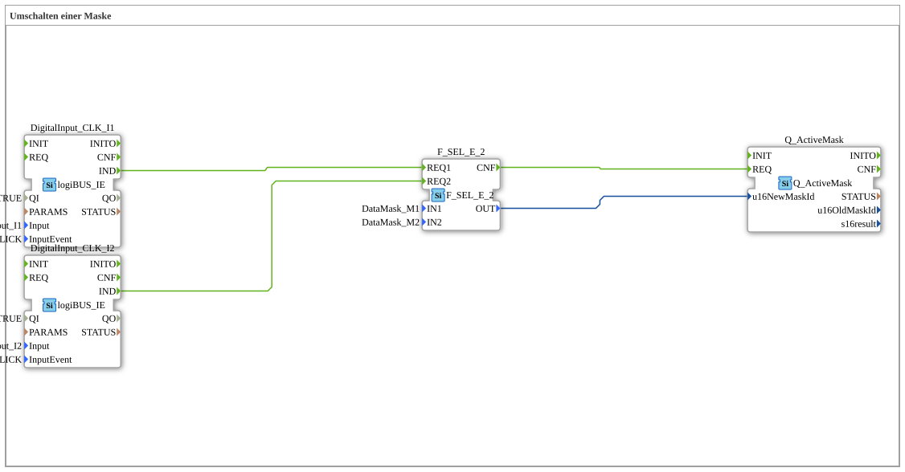

# Exercise_019: Switching a Mask
[](https://notebooklm.google.com/notebook/a6872e59-1dfc-4132-a118-aff1bc7bc944)
This article describes the logiBUS® exercise `Uebung_019`. It demonstrates how the program can switch the active display (data mask) on the terminal.
Exercise_019: Switching a Mask
[](https://notebooklm.google.com/notebook/a6872e59-1dfc-4132-a118-aff1bc7bc944)

This article describes the logiBUS® exercise `Uebung_019`. It shows how the program can switch the active display (data mask) on the terminal.

``` ## 📺 Video



* [Agriculture 1906](https://www.youtube.com/watch?v=rqX10EiEiNM)

## 🎧 Podcast
* [As an agricultural machinery specialist through hell: How Lanz-Wery survived war, occupation, and hyperinflation – Insights into original business reports 1915-1922](https://podcasters.spotify.com/pod/show/ms-muc-lama/episodes/Als-Landtechnik-Spezialist-durch-die-Hlle-Wie-Lanz-Wery-Krieg--Besatzung-und-Hyperinflation-berlebte--Einblicke-in-Original-Geschftsberichte-1915-1922-e39athj)
* [Agriculture and Forestry 4.0: The foundation of safety – Analysis of DIN EN ISO 25119-1 and the ](https://podcasters.spotify.com/pod/show/ms-muc-lama/episodes/Land--und-Forstwirtschaft-4-0-Das-Fundament-der-Sicherheit--Analyse-der-DIN-EN-ISO-25119-1-und-der-e39kn2f)
* [RASE: How 19th-Century England Revolutionized Agriculture Through "Practice with Science"](https://podcasters.spotify.com/pod/show/ms-muc-lama/episodes/RASE-How-19th-Century-England-Revolutionized-Agriculture-Through-Practice-with-Science-e36eb1v)
* [Rudolf Diesel: Brilliant work, mysterious end – Who disappeared in 1913 on the Ferry?](https://podcasters.spotify.com/pod/show/ms-muc-lama/episodes/Rudolf-Diesel-Geniales-Werk--mysterises-Ende--Wer-verschwand-1913-auf-der-Fhre-e396oa6)
* [Smart Farming Vision 1991 Auernhammer's Blueprints](https://podcasters.spotify.com/pod/show/ms-muc-lama/episodes/Smart-Farming-Vision-1991-Auernhammers-Blaupausen-e3b09r2)

----

## Objective of the Exercise

Using the function block `Q_ActiveMask` for navigation on the terminal. It demonstrates how to use physical buttons to scroll between different user interface pages.

-----

## Description and Components

[cite_start]The subapplication `Uebung_019.SUB` uses two physical buttons to select between two user interface screens[cite: 1].

### Function Blocks (FBs)
* **`I1` & `I2`**: Physical input buttons.
* **`F_SEL_E_2`**: An event selector. It has two `REQ` inputs and outputs the corresponding constant at the data output when triggered.
* **`Q_ActiveMask`**: The ISOBUS output block. [cite_start]It sends the command to change the mask to the terminal[cite: 1].

-----

## Functionality
* Pressing **Button 1** ➡️ `F_SEL_E_2` returns the ID of `DataMask_M1` ➡️ `Q_ActiveMask` switches the terminal to page 1.
* Pressing **Button 2** ➡️ `F_SEL_E_2` returns the ID of `DataMask_M2` ➡️ `Q_ActiveMask` switches the terminal to page 2.

The system actively controls what the operator sees.

----

## Application Example

**Context-dependent control**:

When the driver flips the switch for "plowing mode" on the physical control panel, the terminal automatically switches from the road view to the field view with all relevant depth settings. This saves the driver from having to manually search for the correct page on the touchscreen while driving.