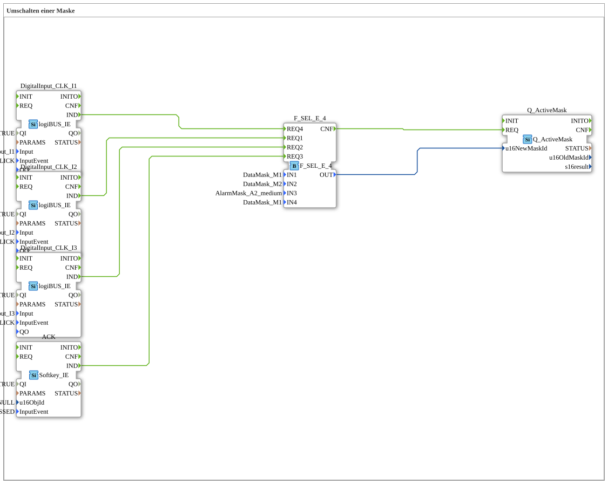

# Exercise_019a: Switching a Mask

This article describes the logiBUS® exercise `Uebung_019a`. Here, mask switching is extended to include a safety function: the alarm.

----

## Objective of the Exercise

Learning how to work with alarm masks. In the ISOBUS standard, alarms take precedence over normal data masks and can often only be exited by an explicit acknowledgment (ACK).

-----

## Description and Components

[cite_start]In `Uebung_019a.SUB`, a four-stage selector (`F_SEL_E_4`) is used for mask selection[cite: 1].

### Function Blocks (FBs)

* **`I1` & `I2`**: Normal screen selection (M1, M2).

* **`I3`**: Alarm trigger.

* **`ACK`**: A softkey on the terminal to acknowledge the alarm.

* **`AlarmMask_A2_medium`**: A special alarm screen from the pool.

-----

## Functionality

1. The user can navigate as usual using `I1` and `I2`.

2. If an error occurs (`I3`), the controller forces the display of `AlarmMask_A2`. The terminal then overlays the current view with the alarm message.

3. Navigation via `I1/I2` is now ineffective or overridden by the alarm (depending on the terminal implementation).

4. Only when the user presses the **ACK** softkey on the terminal does the controller switch back to the normal work interface (`M1`).

-----

## Application Example

**Overload Warning**:

A sensor reports an impending machine overload. The controller interrupts the normal display and prominently displays the warning "Overload!". The operator must consciously acknowledge the error and confirm it on the terminal before they can use the normal displays again.