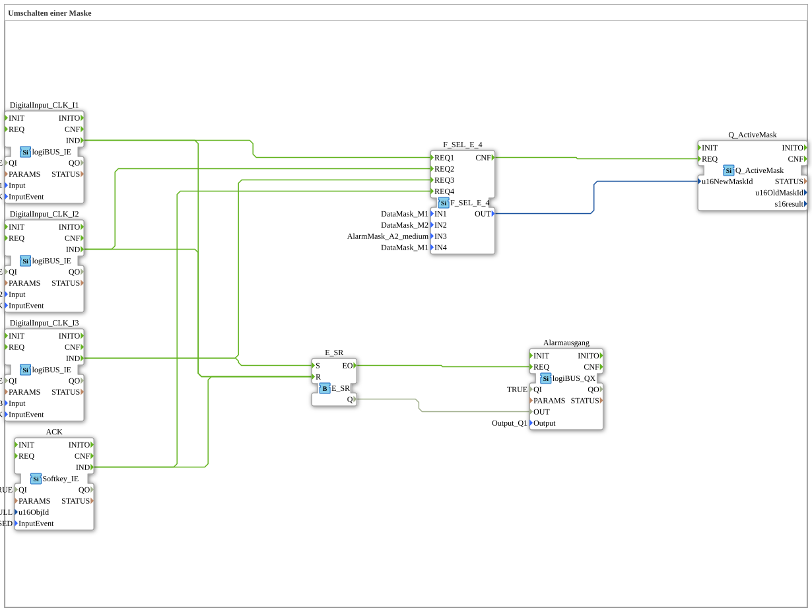

# Exercise_019b: Switching a Mask

This article describes the logiBUS® exercise `Uebung_019b`. Here, the virtual alarm at the terminal is synchronized with a physical alarm output.
----
## Objective of the Exercise

Linking UI states with hardware memories. The goal is to ensure that an alarm state is retained in the controller until it is cleared at the terminal.

-----

## Description and Components

[cite_start]In `Uebung_019b.SUB`, an SR flip-flop is used for the alarm status in addition to the mask switching [cite: 1].

### Function Blocks (FBs)

* **`E_SR`**: The alarm memory.
* **`Alarmausgang`**: Switches a physical horn or warning light (`Q1`).

-----

## Functionality

* **Trigger Alarm**: Pressing button `I3` triggers the alarm. The terminal switches to the alarm screen **AND** the memory `E_SR` is set ➡️ The physical horn sounds.
* **Acknowledge**: The user presses **ACK** on the terminal. The control switches back to the normal screen **AND** clears the memory `E_SR.R` ➡️ The horn stops.
* Interestingly, switching to a different normal mask (`I1`, `I2`) also clears the alarm memory in this implementation (reset branch on `E_SR`).

-----

## Application Example

**Central Alarm Control Panel**:

A critical fault (e.g., oil pressure loss) triggers both the display on the screen and an external siren. The technician must go to the terminal to see what is happening and, by acknowledging the fault, clear the display and silence the siren.