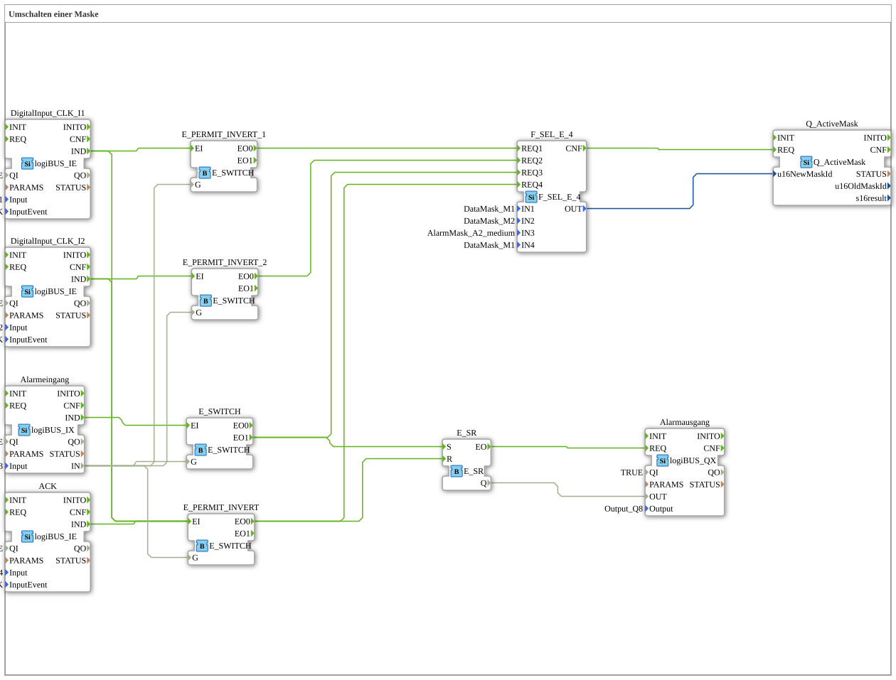

# Exercise_019c: Switching a Screen

This article describes the logiBUS® exercise `Uebung_019c`. This is the most complex navigation logic, where screen switching can be actively blocked by the hardware state.
----
## Objective of the Exercise
Implementation of conditional navigation control. Switching between screen pages should be prevented as long as an active alarm is present.

-----

## Description and Components

[cite_start]The subapplication `Uebung_019c.SUB` uses several `E_SWITCH` blocks as "gatekeepers" for the events[cite: 1].

### Function Blocks (FBs)

* **`Alarmeingang`**: A physical sensor (`I3`). As long as this sensor is in `TRUE`, an alarm state is in effect.
* **`E_SWITCH` (various)**: Check whether the alarm input is active before each action.
* **`ACK`**: A physical acknowledge button (`I4`) instead of a softkey.

-----

## Functionality

The switches block the normal navigation commands:

1. If the user presses `I1` (Mask 1), the event is first sent to `E_SWITCH`.

2. The switch checks `Alarmeingang`.

* If **no** alarm is present (`G=FALSE`), the event is passed to `EO0` ➡️ `F_SEL_E_4`. The page changes.
* If an alarm is active (`G=TRUE`), the event lands at `EO1` (not connected). The page change is **ignored**.

3. If an alarm occurs, the system immediately switches to the alarm screen and activates the horn.

4. Only when the alarm sensor (`I3`) is FALSE **AND** the user presses the acknowledge button (`I4`) is the memory reset and navigation enabled again.

-----

## Application Example

**Mandatory Troubleshooting**:

In the event of a critical hardware fault (e.g., emergency stop activated), the operator must not continue using the terminal for normal machine control. They will be "held" on the alarm screen until the emergency stop is released and the fault acknowledged. This forces attention to be paid to the primary safety issue.