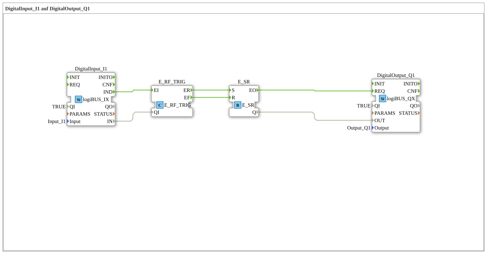

# Exercise_020a: DigitalInput_I1 to DigitalOutput_Q1

[(https://notebooklm.google.com/notebook/a6872e59-1dfc-4132-a118-aff1bc7bc944)
This article describes the logiBUS® exercise `Uebung_020a`. It demonstrates the manual generation of set and reset events from a standard data signal.
----
## Objective of the Exercise

Understanding edge detection. It shows how to implement behavior using an event switch (`E_SWITCH`) and a memory (`E_RS`) where the output is switched on when a button is pressed and switched off when it is released (functionally equivalent to a direct line, but with explicit logic separation).

-----

## Description and Components

[cite_start]The subapplication `Uebung_020a.SUB` uses a `logiBUS_IX` input to control a `E_RS` memory [cite: 1].

### Function Blocks (FBs)

* **`DigitalInput_I1`**: Standard input. Provides an event on every change.
* **`E_SWITCH`**: Forwards the event to either `S` or `R`, depending on the level.
* **`E_RS`**: The event memory.

-----

## Functionality

1. **Pull (TRUE)**: The `IND` event goes to the switch. Since `G=TRUE` is present, `EO1` fires ➡️ `E_RS.S` (Set).
2. **Release (FALSE)**: The `IND` event goes to the switch. Since `G=FALSE` is present, `EO0` fires ➡️ `E_RS.R` (Reset).

Although the result is a 1:1 mapping of the input, this exercise demonstrates the internal mechanism of memory systems.