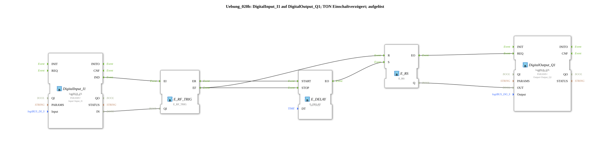

# Exercise_020b: DigitalInput_I1 to DigitalOutput_Q1; TON Switch-on Delay; resolved

This article describes the logiBUS® exercise `Uebung_020b`. Here, a switch-on delay (TON) is manually constructed from basic building blocks.
----
## Objective of the Exercise
Understanding time control through event delay (`E_DELAY`). It demonstrates how a timer behavior ("light only switches on after 2 seconds") is implemented by selectively delaying and canceling events.

-----

## Description and Components

[cite_start]In `Uebung_020b.SUB`, a delay block is connected between the input switch and the memory [cite: 1].

### Function Blocks (FBs)

* **`E_DELAY`**: Waits for the time `DT` (2 seconds).
* **`E_SWITCH`**: Controls the start and stop of the timer.

-----

## Functionality

1. **Start**: User presses `I1`. The switch moves to `EO1` ➡️ `E_DELAY.START`.

2. **Wait**: If the user holds the button down for a full 2 seconds, `E_DELAY.EO` ➡️ `E_RS.S` is triggered. The indicator light illuminates.

3. **Cancel**: If the user releases the button before the 2 seconds have elapsed, the switch switches to `EO0`. This event triggers `E_DELAY.STOP` (timer is cleared) **and** `E_RS.R` (output is reliably set to FALSE).

Result: Switch-on delay with immediate cancellation upon signal loss.