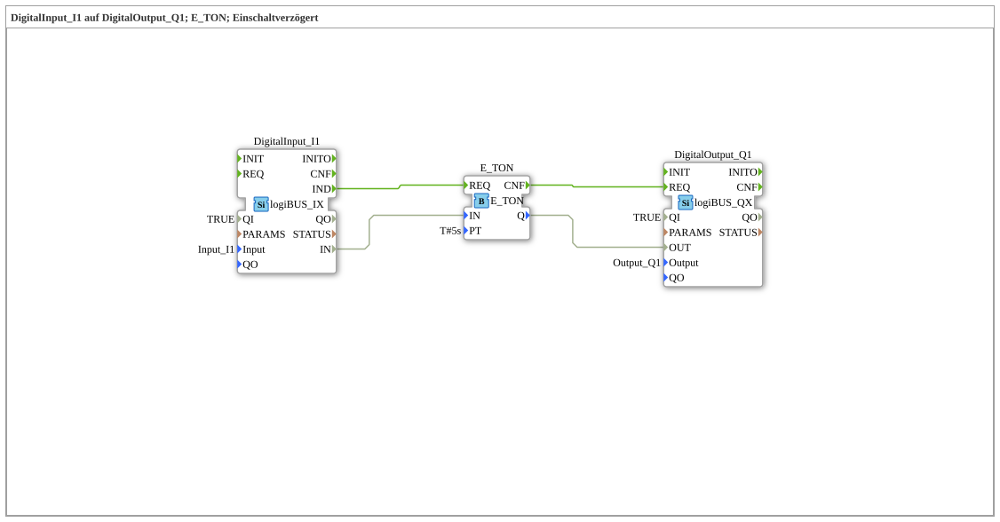

# Exercise_020c: DigitalInput_I1 to DigitalOutput_Q1; E_TON; Power-On Delay

This article describes the logiBUS® exercise `Uebung_020c`.
----
## Objective of the Exercise

Using the standardized timer block `E_TON`.

-----

## Description and Components

[cite_start]The subapplication `Uebung_020c.SUB` uses the `E_TON` block from the Event Timer Library[cite: 1].

### Function Blocks (FBs)

* **`E_TON`**: Timer ON-Delay (Event-based).
* **Parameter `PT`**: Preset Time (here 5 seconds).

-----

## Functionality

This function block significantly simplifies the setup from Exercise 020b:

* Input `I1` becomes TRUE ➡️ Timer starts.
* After 5 seconds, output `Q` becomes TRUE.
* Input `I1` becomes FALSE ➡️ Timer stops, output immediately becomes FALSE.

This is the standard way to implement delays in 4diac.

---

### 🌐 Related topic subpages on ms-muc-docs.de

* [🌐 Eclipse 4diac IDE & Color Reference on ms-muc-docs.de](https://www.ms-muc-docs.de/iec-61499/eclipse-4diac/)

]