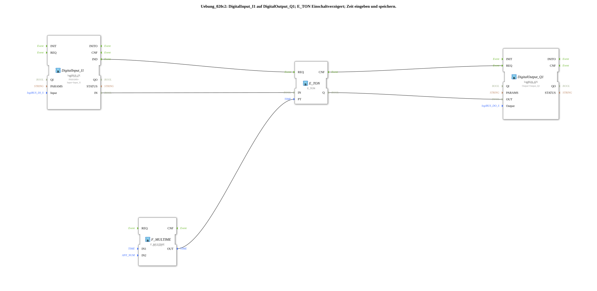

# Exercise_020c2: DigitalInput_I1 to DigitalOutput_Q1; E_TON power-on delay; Enter and save the time.

[(https://notebooklm.google.com/notebook/a6872e59-1dfc-4132-a118-aff1bc7bc944)
This article describes the logiBUS® exercise `Uebung_020c2`. Here, the power-on delay is combined with user input at the terminal and data storage.
----
## Objective of the exercise

Dynamic adjustment of timer times at runtime.

-----

## Description and components

[cite_start]In `Uebung_020c2.SUB`, the delay time (`PT`) is not hardcoded in the program, but is read from the ISOBUS terminal[cite: 1].

### Function Blocks (FBs)

* **`Uebung_020c2_sub`**: A memory sub-app (as in Exercise 012a) that manages the numeric value entered by the user.
* **`F_MULTIME`**: Multiplies a time value. Here, the numeric value (e.g., "5") is multiplied by the unit `T#1s` to create the data type `TIME` for the timer (e.g., 5 seconds).
* **`E_TON`**: The actual delay block.

-----

## Functionality

1. The user enters "5" at the terminal.
2. The value is stored in the NVS and passed to the logic.
3. `F_MULTIME` makes this 5 seconds.
4. If the physical button `I1` is now pressed, `E_TON` delays the signal by exactly these 5 seconds.

If the user changes the value on the terminal to "10", the timer will now react with a 10-second delay.