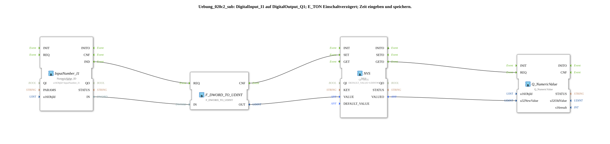

# Exercise_020c2_sub: DigitalInput_I1 to DigitalOutput_Q1; E_TON Switch-on Delay; Enter and save time.

## Overview

[cite_start]This sub-app type is a specialized version of `Uebung_012a_sub`, optimized for managing numerical time values at the ISOBUS terminal[cite: 1]. It handles all the logic from user input and power-failure-proof storage to the continuous provision of the value for subsequent timers (as shown in Exercise 020c2).
## 🛠️ Related Exercises

* [Exercise_020c2](Uebung_020c2.md)
