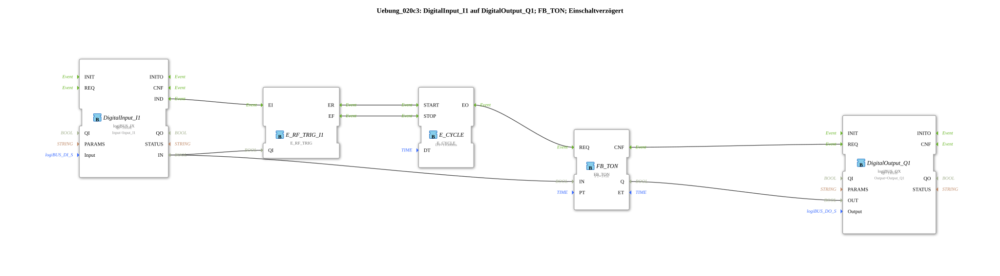

# Exercise_020c3: DigitalInput_I1 to DigitalOutput_Q1; FB_TON; Power-On Delay

This article describes the logiBUS® exercise `Uebung_020c3`. It uses the classic IEC 61131-3 timer block `FB_TON`, which requires regular triggering (clock).

**Important note: This block only functions correctly if it is called cyclically.**
----

## Objective of the exercise

The objective is to implement a power-on delay using classic PLC behavior (including an ET output) in an event-driven environment. Unlike the event-based `E_TON`, the `FB_TON` requires a regular trigger (sampling) to update its internal timer and the output `ET`.

-----

## Description and Components

[cite_start]In `Uebung_020c3.SUB`, a clock is used to drive the classic timer[cite: 1].

### Function Blocks (FBs)

* **`FB_TON`**: The classic TON block.
* **`E_CYCLE`**: A timer that sends an event to the `REQ` input of the timer every 500 ms.

-----

## Functionality

For the `FB_TON` to function correctly, it must be "queried."

1. The user presses button `I1`. The signal is present at the timer's data input `IN`.
2. Simultaneously, the button triggers `E_CYCLE` via a switch.
3. Every 500 ms, the cycle requests the timer to perform a calculation (`REQ`).
4. Only during these queries does the timer check how much time has elapsed.
5. As soon as 5 seconds are reached, the output `Q` switches to TRUE.

This method is necessary when integrating building blocks from the 61131 world into the 61499 event world.