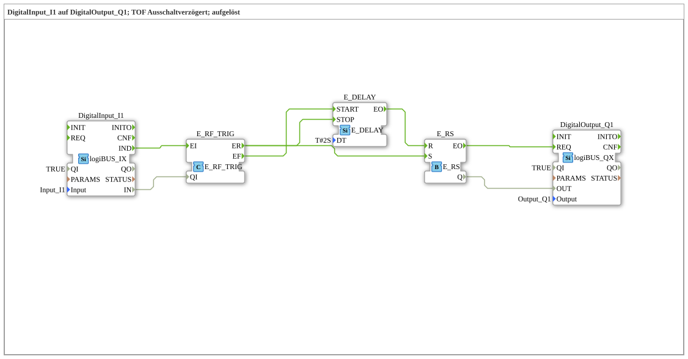

# Exercise_020d: DigitalInput_I1 to DigitalOutput_Q1; TOF Delay Off; resolved

[(https://notebooklm.google.com/notebook/a6872e59-1dfc-4132-a118-aff1bc7bc944)
This article describes the logiBUS® exercise `Uebung_020d`. Here, the function of a time-of-flight (TOF) delay is built manually from basic function blocks.
----
## Objective of the exercise

Implementation of a delay behavior. The output should activate immediately when the button is pressed, but remain active for a defined time (2 seconds) after it is released.

-----

## Description and Components

[cite_start]In `Uebung_020d.SUB`, the TOF logic is implemented through a clever combination of `E_DELAY` and `E_RS`[cite: 1].

### Functionality

1. **Power On**: The user presses `I1`. The switch forwards the event to `EO1`. This does two things:
- The memory `E_RS` is set immediately (the light turns on).
- Any delay timer that may still be running is stopped (`E_DELAY.STOP`).
2. **Hold**: As long as the button is pressed, the state remains stable.
3. **Switch Off**: The user releases `I1`. The switch moves to `EO0`. This triggers the delay timer (`E_DELAY.START`).
4. **Run-On**: Only after 2 seconds have elapsed does the timer fire `E_DELAY.EO` ➡️ `E_RS.R`. The memory is reset, and the light turns off.

-----

## Application Example

**Interior Lighting in a Car**: As soon as the door is opened (`I1`), the light turns on. When the door is closed, the light remains on for a few seconds to allow the user to fasten their seatbelt before turning off.
