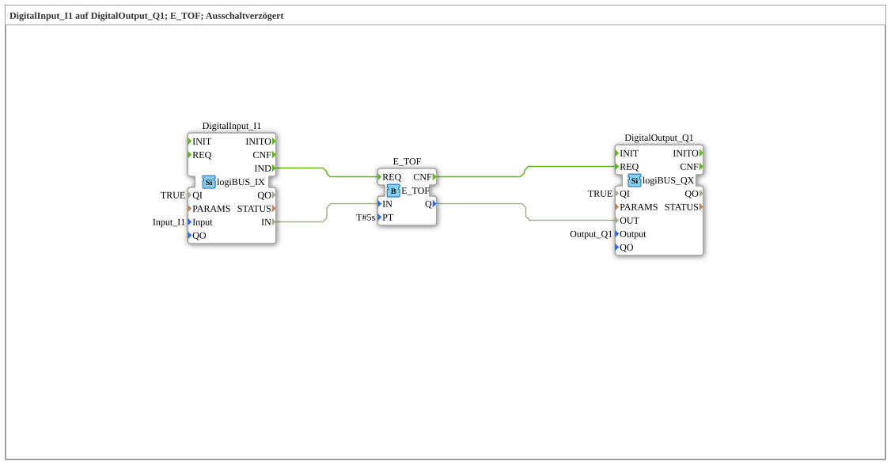

# Exercise_020e: DigitalInput_I1 to DigitalOutput_Q1; E_TOF; Delayed Off

[(https://notebooklm.google.com/notebook/a6872e59-1dfc-4132-a118-aff1bc7bc944)
This article describes the logiBUS® exercise `Uebung_020e`.
## 🎧 Podcast

* Understanding the Infineon BTM9020EP full bridge ](https://podcasters.spotify.com/pod/show/ms-muc-lama/episodes/Infineon-BTM9020EP-Vollbrcke-verstehen-e3b8n24)
* Integrated full bridge ICs MOTIX™ BTM9020EP ](https://podcasters.spotify.com/pod/show/ms-muc-lama/episodes/integrierten-Vollbrcken-ICs-MOTIX-BTM9020EP-e368kse)

----

## Overview

[cite_start]Using the standardized event-based timer `E_TOF`[cite: 1]. The logic corresponds to exercise 020d, but is encapsulated in a single module. A signal at input `IN` is immediately passed through to output `Q`. If `IN` is lost, `Q` remains at `PT` (here 5 seconds).
