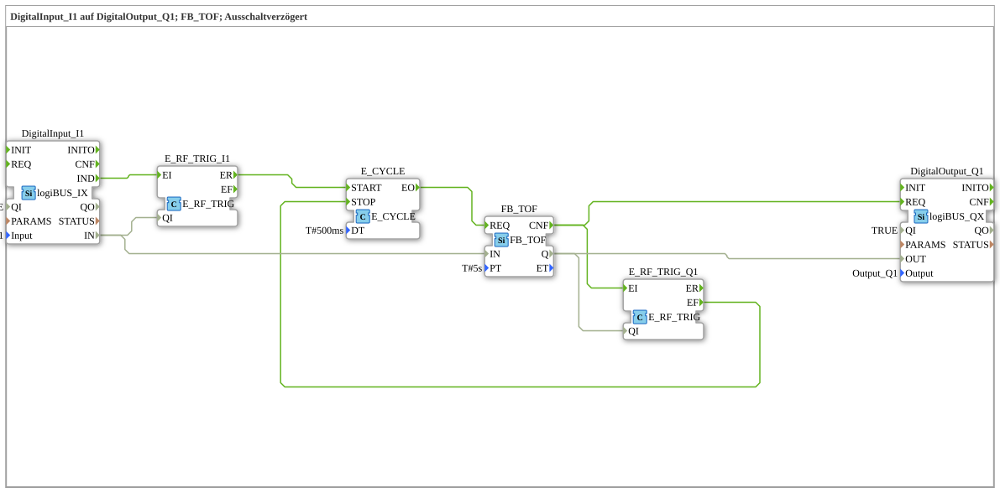

# Exercise_020e2: DigitalInput_I1 to DigitalOutput_Q1; FB_TOF; Delayed Off

This article describes the logiBUS® exercise `Uebung_020e2`. It uses the classic IEC 61131-3 timer block `FB_TOF`, which requires regular triggering (clocking).

**Important note: This block only functions correctly if it is called cyclically.**
----

## Overview

Demonstration of the classic `FB_TOF` block. Since this component requires cyclic queries, it is driven by a `E_CYCLE` (here 500ms), as in exercise 020c3. Additionally, a second `E_SWITCH` at the output ensures that the clock generator `E_CYCLE` is stopped as soon as the overrun time is complete.