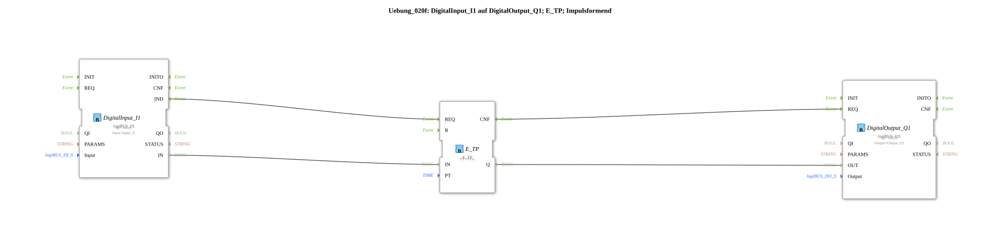

# Exercise_020f: DigitalInput_I1 to DigitalOutput_Q1; E_TP; Pulse Shaping

This article describes the logiBUS® exercise `Uebung_020f`.

----

## Purpose of the Exercise

Using the pulse-shaping timer `E_TP` (Timer Pulse).

-----

## Functionality

[cite_start]As soon as the input `IN` switches to `TRUE`, the output `Q` switches on for exactly the time `PT` (here 5 seconds)[cite: 1].

[cite: 1] The special feature: The output remains active for the entire duration, even if the input `IN` drops out in the meantime or is pressed multiple times (not re-triggerable).

-----

## Application Example

**Door Opener**: A short press of the button makes the electric door opener buzz for 5 seconds, allowing the guest to enter. The timer runs regardless of how long the resident actually holds the button down.