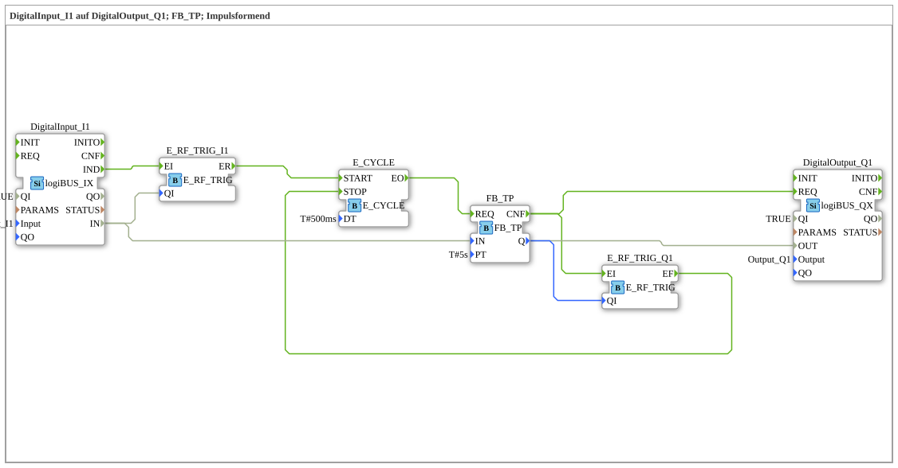

# Exercise_020f2: DigitalInput_I1 to DigitalOutput_Q1; FB_TP; Pulse Shaping

This article describes the logiBUS® exercise `Uebung_020f2`. Here, the classic IEC 61131-3 timer block `FB_TP` is used.

----

## Overview

This exercise implements a pulse generator using the classic `FB_TP` block. Since this block was designed for a cyclic PLC environment, a `E_CYCLE` must be used for regular triggering in the event-based IEC 61499.

## Functionality

1. **Trigger**: The rising edge of `Input_I1` triggers the clock generator `E_CYCLE` via `E_SWITCH`.

2. **Calculation**: Every 500 ms, `E_CYCLE` triggers the `REQ` input of `FB_TP`. This is the only way the timer can increment the time internally and update the output `ET` (Elapsed Time).

2. **Calculation**: `E_CYCLE` triggers the `REQ` input of `FB_TP`. 3. **Termination**: As soon as the pulse is complete (`Q` goes to `FALSE`), `E_CYCLE` stops automatically to avoid unnecessary CPU load.

-----

## ⚖️ Comparison to the AX variant

Unlike the `AX_FB_TP` variant (Exercise 020f2_AX), this version uses classic Boolean inputs and outputs instead of the more flexible AX adapters. However, the underlying problem of the cyclic call remains the same.