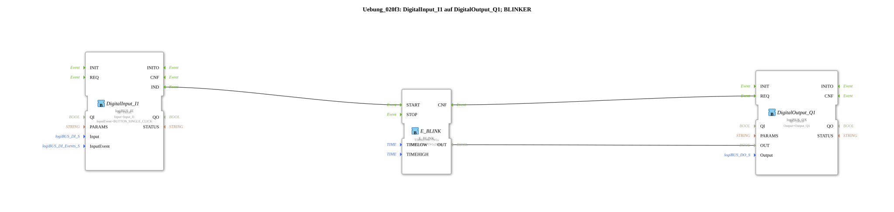

# Exercise_020f3: DigitalInput_I1 to DigitalOutput_Q1; Flasher

This article describes the logiBUS® exercise `Uebung_020f3`.
----
## Overview

[cite_start]Using the specialized flasher block `E_BLINK`[cite: 1]. This block summarizes all the logic for exercise 007a3.

Asymmetrical flashing patterns (e.g., short flashes) can be easily implemented using separate parameters for `TIMELOW` and `TIMEHIGH`. An event at input `START` activates the flasher.

