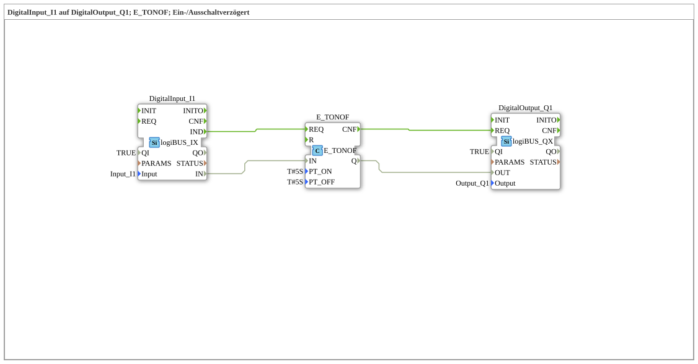

# Exercise_020g: DigitalInput_I1 to DigitalOutput_Q1; E_TONOF; On/Off Delay

[(https://notebooklm.google.com/notebook/a6872e59-1dfc-4132-a118-aff1bc7bc944)
This article describes the logiBUS® exercise `Uebung_020g`.
----
## Objective of the Exercise

Use of the function block `E_TONOF`, which provides both an on and off delay in a single package.

-----

## Functionality

[cite_start]The module reacts to the level at input `IN`[cite: 1]:

* Switch to `TRUE`: The output only becomes active after `PT_ON` (5 seconds) has elapsed.
* Switch to `FALSE`: The output remains active for `PT_OFF` (5 seconds).

This completely filters out short pulses (interference) at the input and simultaneously ensures a defined delay.