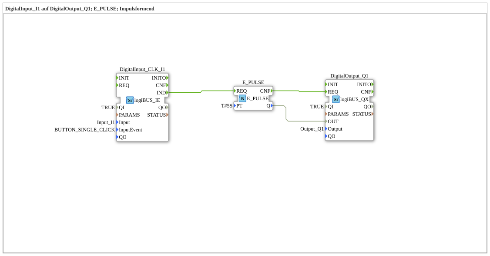

# Exercise_020h: DigitalInput_I1 to DigitalOutput_Q1; E_PULSE; Pulse Shaping

This article describes the logiBUS® exercise `Uebung_020h`.
----
## Overview
[cite_start]This exercise demonstrates controlling the function block `E_PULSE` via an event input (`logiBUS_IE`)[cite: 1].

Each detected single click on the button triggers a pulse of exactly 5 seconds at the output. Since `E_PULSE` is a pure event function block, it does not require a continuous data signal at the input, but only the start trigger.

