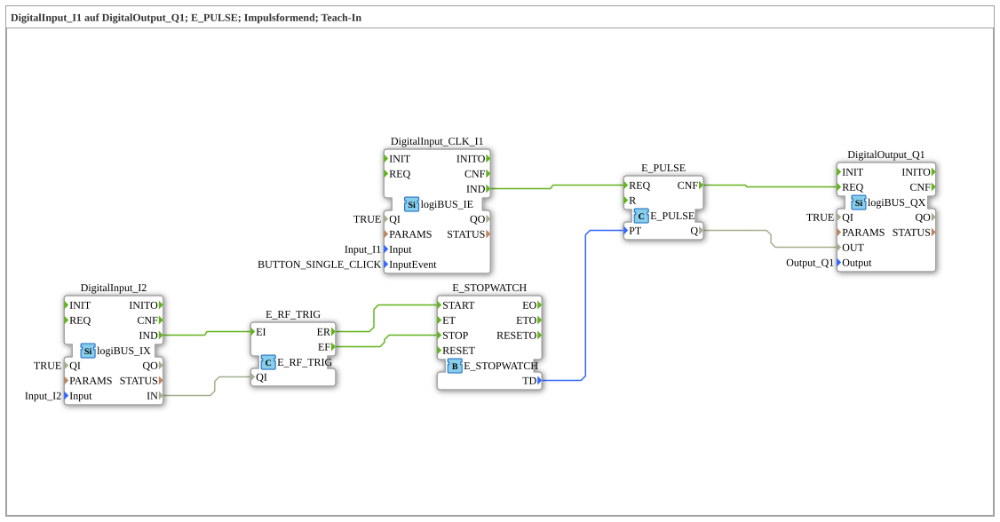

# Exercise_020i: DigitalInput_I1 to DigitalOutput_Q1; E_PULSE; Pulse Shaping; Teach-In

[(https://notebooklm.google.com/notebook/a6872e59-1dfc-4132-a118-aff1bc7bc944)
This article describes the logiBUS® exercise `Uebung_020i`. This is a very practical exercise in which a time duration is learned not through numerical values, but through demonstration (teach-in).
----
## Objective of the Exercise

Programming a variable pulse duration using the `E_STOPWATCH` function block.

-----

## Description and Components

[cite_start]The subapplication `Uebung_020i.SUB` uses two buttons: one for execution and one for learning the time.[cite: 1]

### Function Blocks (FBs)

- **`E_STOPWATCH`**: Measures the time between a start and a stop event.
- **`E_PULSE`**: Generates the timed pulse.
- **`I2` (Learn Button)**: A normal level input (`IX`).
- **`I1` (Start Button)**: A click event input (`IE`).

-----

## Operation

1. **Learn Mode**: The user presses and holds button `I2`.
- Pressing the button (rising edge) starts the stopwatch.

Releasing the button (falling edge) stops the stopwatch.

The measured time duration (`TD`) is immediately transferred to the pulse generator's parameter `PT`.

2. **Operating Mode**: The user briefly clicks button `I1`.

The `E_PULSE` is triggered.

It activates the output for precisely the time previously set by button `I2`.

-----

## Application Example

**Central lubrication or irrigation**:

Instead of tediously entering values in seconds into a terminal, the maintenance technician presses the learn button once for the duration they deem necessary for the process. The controller then uses this time frame for all future automatic cycles.
