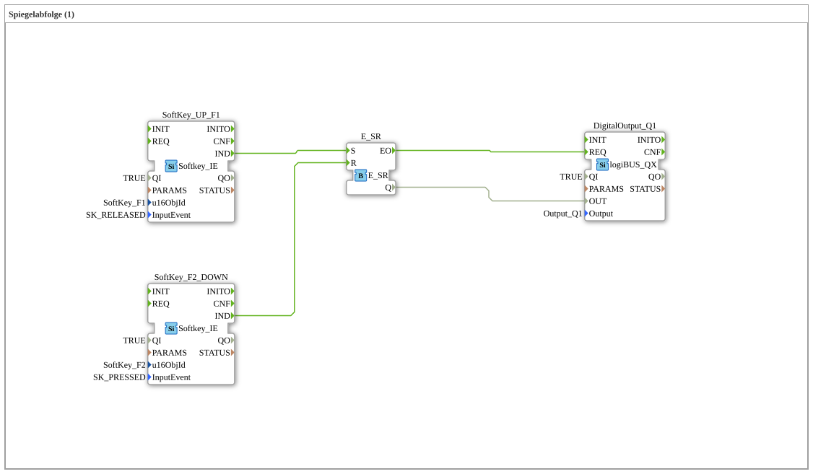

# Exercise_021: Mirror Sequence (1)

[(https://notebooklm.google.com/notebook/a6872e59-1dfc-4132-a118-aff1bc7bc944)
This article describes the logiBUS® exercise `Uebung_021`. This is an introduction to sequence control, simulated using the example of a pneumatic cylinder.

## 🎧 Podcast

- [Infineon MOTIX BTM9020/9021EP: Datasheet Analysis for Automotive – Robust Motor Driver with Intelligent Diagnostics (HW vs. SPI)](https://podcasters.spotify.com/pod/show/ms-muc-lama/episodes/Infineon-MOTIX-BTM90209021EP-Datenblatt-Analyse-fr-Automotive--Robuster-Motortreiber-mit-intelligenter-Diagnose-HW-vs--SPI-e39av51)
- [JBC Soldering Tips C470 vs. C245 vs. C210 vs. C115: Which Tip is the All-Rounder and When Do You Need the Nano Specialist?](https://podcasters.spotify.com/pod/show/ms-muc-lama/episodes/JBC-Ltspitzen-C470-vs--C245-vs--C210-vs--C115-Welche-Spitze-ist-der-Allrounder-und-wann-brauchst-du-den-Nano-Spezialisten-e39ak58)

----

## Objective of the Exercise

Implementation of a simple sequence control: A process is started and stops automatically as soon as an end position is reached.

-----

## Description and Components

[cite_start]The subapplication `Uebung_021.SUB` uses two softkeys to control the movement of an actuator (`Q1`)[cite: 1].

### Function Blocks (FBs)

- **`SoftKey_UP_F1`**: Functions as a **START button**. [cite_start]It is configured on `SK_RELEASED`[cite: 1].
- **`SoftKey_F2_DOWN`**: Simulates the **limit switch**. [cite_start]It reacts immediately when pressed (`SK_PRESSED`)[cite: 1].
- **`E_SR`**: The memory for the movement state.
- **`DigitalOutput_Q1`**: The output for the cylinder valve.

-----

## Functionality

1. **Start**: The user presses **F1**. This event sets the memory `E_SR.S` ➡️ The output `Q1` becomes active, and the cylinder extends.
2. **Movement**: The cylinder physically (or in the simulation) moves to its end position.
3. **Stop**: As soon as the cylinder reaches its end position, the reset input `E_SR.R` is triggered (simulated by **F2**) ➡️ The output `Q1` is deactivated, and the movement stops.

-----

## Application Example

**Simple Ejector**:

In a production line, a package is to be pushed off the conveyor belt at the push of a button. The operator gives the start signal, the cylinder extends, pushes the package away, and is automatically switched off again by a mechanical limit switch at the end of its travel.

--

### 🌐 Related topic subpages on ms-muc-docs.de

- [🌐 Interactive JBC Soldering Tip Guide & Infographic on ms-muc-docs.de](https://www.ms-muc-docs.de/elektrotechnik/werkzeug/lötkolben/jbc-lötspitzen-übersicht/)

]
