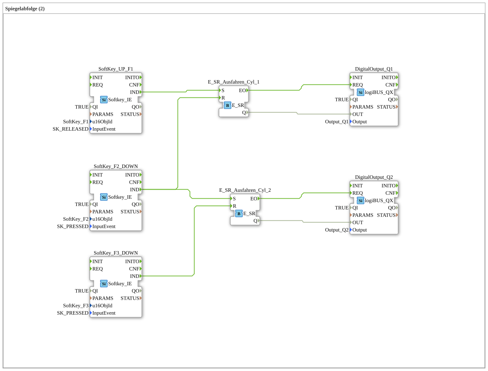

# Exercise_022: Mirror Sequence (2)

[(https://notebooklm.google.com/notebook/a6872e59-1dfc-4132-a118-aff1bc7bc944)
This article describes the logiBUS® exercise `Uebung_022`. Here, the process control is extended to two consecutive steps.

## 🎧 Podcast

- [As an agricultural machinery specialist through hell: How Lanz-Wery survived war, occupation, and hyperinflation – Insights into original business reports 1915-1922](https://podcasters.spotify.com/pod/show/ms-muc-lama/episodes/Als-Landtechnik-Spezialist-durch-die-Hlle-Wie-Lanz-Wery-Krieg--Besatzung-und-Hyperinflation-berlebte--Einblicke-in-Original-Geschftsberichte-1915-1922-e39athj)

----

## Goal of the exercise

Learning about event chaining. The end of a process (reaching the final position) should automatically initiate the next process step.

-----

## Description and Components

[cite_start]In `Uebung_022.SUB`, two memory elements are connected to create a cascade[cite: 1].

### Function Blocks (FBs)

- **`I1` (Start)**: Starts the entire sequence.
- **`I2` (End Position 1)**: Completes step 1 and starts step 2.
- **`I3` (End Position 2)**: Completes step 2.
- **`Q1` & `Q2`**: The outputs for two cylinders.

-----

## Functionality

<EventConnections>
<Connection Source="SoftKey_UP_F1.IND" Destination="E_SR_Cyl_1.S"/>
<Connection Source="SoftKey_F2_DOWN.IND" Destination="E_SR_Cyl_1.R"/>
<Connection Source="SoftKey_F2_DOWN.IND" Destination="E_SR_Cyl_2.S"/>
<Connection Source="SoftKey_F3_DOWN.IND" Destination="E_SR_Cyl_2.R"/>
</EventConnections>

[cite_start][cite: 1]

The sequence:

1. Press **F1** ➡️ Cylinder 1 extends (`Q1`).
2. Cylinder 1 reaches its end position (**F2**) ➡️ `Q1` is switched off **AND** simultaneously, Cylinder 2 is started (`Q2`).
3. Cylinder 2 reaches its end position (**F3**) ➡️ `Q2` is switched off.

-----

## Application Example

**Two-stage package transfer**:

Cylinder 1 pushes a package from a magazine onto a lifting table. As soon as the package arrives there (limit switch 1), Cylinder 1 stops and Cylinder 2 lifts the table.
