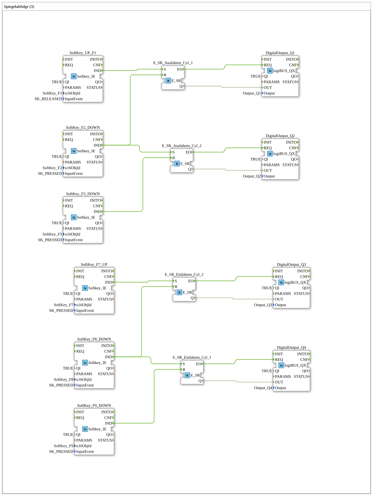

# Exercise_023: Mirror Sequence (3)

This article describes the logiBUS® exercise `Uebung_023`. Here, a complete forward and return path for two cylinders is implemented.

----

## Overview

[cite_start]This exercise extends the logic to a total of four phases using six softkeys[cite: 1]:

1. **Extension**: `F1` (Start) ➡️ `Q1` on. End position reached via `F2`.
...[cite_start] 2. **Next step**: `F2` stops `Q1` and starts `Q2`. End position is reached via `F3`.

3. **Retraction**: The retraction sequence is initiated via separate buttons (`F7`, `F8`) (`Q3`, `Q4`).

This demonstrates the handling of complex, direction-dependent processes in a flat event structure.