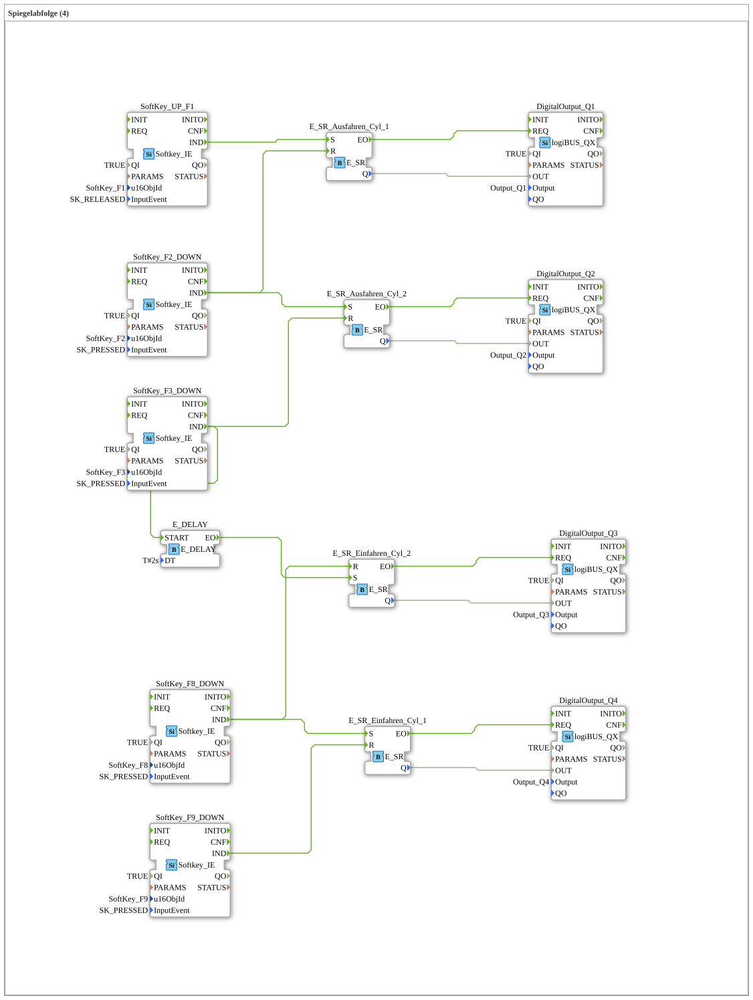

# Exercise_024: Mirror Sequence (4)
[](https://notebooklm.google.com/notebook/a6872e59-1dfc-4132-a118-aff1bc7bc944)
This article describes the logiBUS® exercise `Uebung_024`. Here, a time pause is integrated into the automatic sequence.
```
## 🎧 Podcast


* [Analysis of the amendment to the Master Craftsman Examination Regulations in the agricultural and construction machinery mechatronics trade: A detailed comparison of the 2024 and 2001 regulations ](https://podcasters.spotify.com/pod/show/ms-muc-lama/episodes/Analyse-der-Novellierung-der-Meisterprfungsverordnung-im-Land--und-Baumaschinenmechatroniker-Handwerk-Ein-Detaillierter-Vergleich-der-Verordnungen-von-2024-und-2001-e37aejv)
* [JBC Soldering Tips C470 vs. C245 vs. C210 vs. C115: Which tip is the all-rounder and when do you need the nano specialist? ](https://podcasters.spotify.com/pod/show/ms-muc-lama/episodes/JBC-Ltspitzen-C470-vs--C245-vs--C210-vs--C115-Welche-Spitze-ist-der-Allrounder-und-wann-brauchst-du-den-Nano-Spezialisten-e39ak58)
* [Strip-till in maize cultivation: How high precision saves water and protects the soil – Insights into agricultural technology 2024 ](https://podcasters.spotify.com/pod/show/ms-muc-lama/episodes/Strip-Till-im-Maisanbau-Wie-Hochprzision-Wasser-spart-und-den-Boden-schtzt--Einblick-in-die-Agrartechnik-2024-e3ahcvp)

----

## Objective of the exercise

Integration of time elements (`E_DELAY`) into an event chain.

-----

## Functionality

[cite_start]Compared to Exercise 023, a delay block is inserted between two steps[cite: 1].

When cylinder 2 reaches its end position (`F3`), the next step is not triggered immediately. Instead, the input `E_DELAY.START` is triggered. Only after the time `DT` (here 2 seconds) has elapsed does the `EO` event fire and continue the sequence (e.g., starting the retraction).

----

## Application Example

**Pressing Process**:

A cylinder extends and presses two components together. Once the end position is reached, the pressure must be maintained for 2 seconds (waiting time) before the cylinder retracts and releases the workpiece.

---

### 🌐 Related topic subpages on ms-muc-docs.de
* [🌐 Interactive JBC soldering tip guide & infographic on ms-muc-docs.de](https://www.ms-muc-docs.de/elektrotechnik/werkzeug/lötkolben/jbc-lötspitzen-übersicht/)

]
