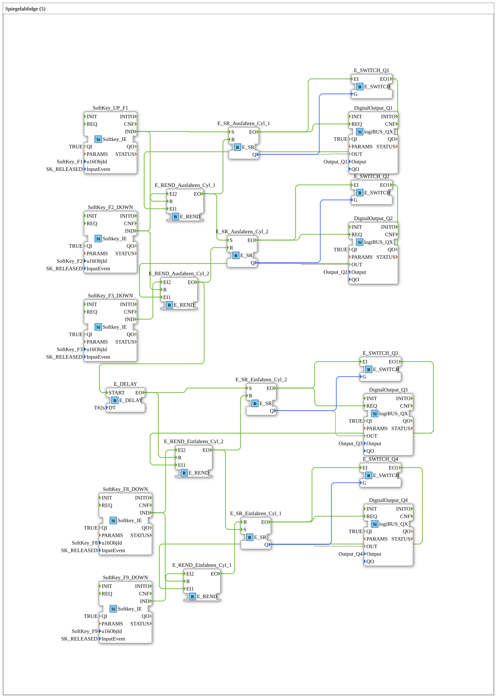

# Exercise_025: Mirror Sequence (5)

This article describes the logiBUS® exercise `Uebung_025`. Here, the sequence control is secured using rendezvous blocks.

## 📺 Video

* Soldering in 2025](https://www.youtube.com/watch?v=fpcOFSE5sl0)

## 🎧 Podcast

* ETFA 2025: Plug and Produce – How IEC 61499 is Revolutionizing Factory Automation](https://podcasters.spotify.com/pod/show/iec-61499-grundkurs-de/episodes/ETFA-2025-Plug-and-Produce--Wie-IEC-61499-die-Fabrikautomation-revolutioniert-e376pnk)

* IEC 61499: Leap into Industry – ETFA 2025 and the Future of Automation](https://podcasters.spotify.com/pod/show/iec-61499-grundkurs-de/episodes/IEC-61499-Sprung-in-die-Industrie--ETFA-2025-und-die-Zukunft-der-Automatisierung-e376pnm)

* Industrial Revolution Reloaded: Unpacking Plug & Produce, Data Privacy, and ETFA 2025](https://podcasters.spotify.com/pod/show/iec-61499-grundkurs-de/episodes/Industrial-Revolution-Reloaded-Unpacking-Plug--Produce--Data-Privacy--and-ETFA-2025-e376pid)

* Industrial Revolutions: From Steam Engine to AI – A Deep Look at 250 Years of Automation](https://podcasters.spotify.com/pod/show/iec-61499-grundkurs-de/episodes/Revolutionen-der-Industrie-Von-Dampfmaschine-bis-KI--Ein-tiefer-Einblick-in-250-Jahre-Automatisierung-e375ei5)

* The Tracked Monster Awakens: Lanz Bulldog Caterpillar – The fascinating revival of the 10-liter hot-bulb workhorse after 25 years of inactivity

----

## Objective of the exercise

Using `E_REND` to safeguard transitions. The goal is to ensure that a subsequent step is only triggered when both the hardware feedback (end position) and the logical software event (readiness) are present.

-----

## Functionality

[cite_start]The exercise uses a `E_REND` block for each transition[cite: 1].

Additionally, `E_SWITCH` blocks are used for plausibility checks. An event is only accepted as a valid end position if the corresponding output (`Q`) of the controller is actually active at that time (feedback of the data to the gate of the switch). This prevents incorrect control due to defective or stuck sensors.