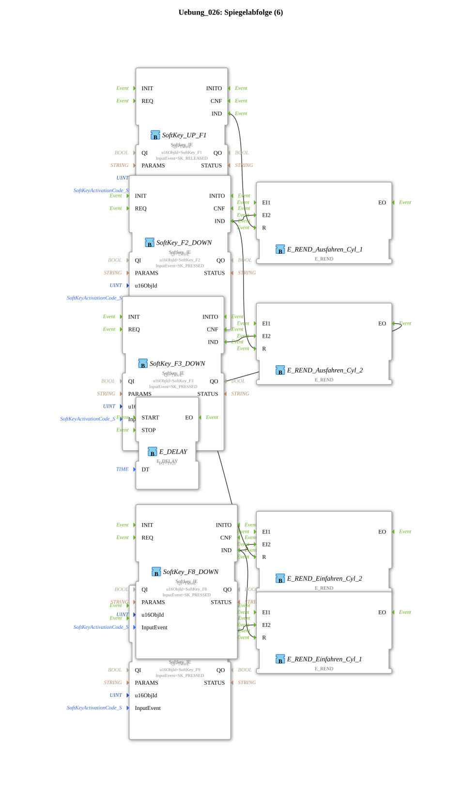

# Exercise_026: Mirror Sequence (6)

This article describes the logiBUS® exercise `Uebung_026`.

----

## Overview

[cite_start]In this exercise, the complex sequence logic from Exercise 025 is retained, but the control of the hardware outputs is outsourced to a typed sub-application `Uebung_026_sub`[cite: 1].

Each instance of this sub-application (`Q1` to `Q4`) encapsulates an SR memory and the hardware output module. The main diagram becomes significantly clearer, as only the event sequence between the phases (rendezvous and delays) is visible, while the "performance layer" operates in the background.

