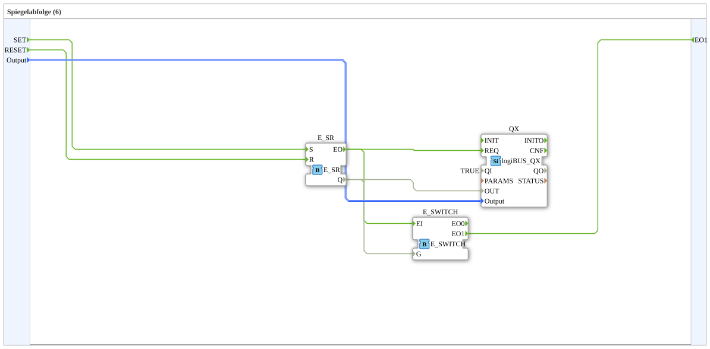

# Exercise_026_sub: Mirror Sequence (6)

[(https://notebooklm.google.com/notebook/a6872e59-1dfc-4132-a118-aff1bc7bc944)
This article describes the sub-application type `Uebung_026_sub`. This function block serves as a standardized interface for actuators within a complex sequence of steps.
----
## Purpose of the Exercise

Encapsulation of the output logic. The function block separates the execution logic (when must something happen) from the hardware logic (how is the cylinder controlled).

-----

## Description and Components

[cite_start]The type `Uebung_026_sub` combines a memory with a plausibility check[cite: 1].

### Internal Function Blocks (FBs)

* **`E_SR`**: Stores whether the actuator should currently be active.
* **`QX`**: Type `logiBUS_QX`. Controls the physical port.
* **`E_SWITCH`**: Serves as a feedback gate. [cite_start]Only if the memory is actually set to TRUE is the confirmation event passed on at output `EO1`[cite: 1].

-----

## Interfaces

[cite_start]The block offers a clear event interface[cite: 1]:

* **`SET`**: Switches the actuator on.
* **`RESET`**: Switches the actuator off.
* **`EO1`**: Reports successful execution of the power-on command (acknowledgment).

In the main application, this type allows for very clear wiring of the phase transitions, as the details of memory management and hardware addressing remain hidden internally.

## 🛠️ Related Exercises

* [Exercise_026](Uebung_026.md)
