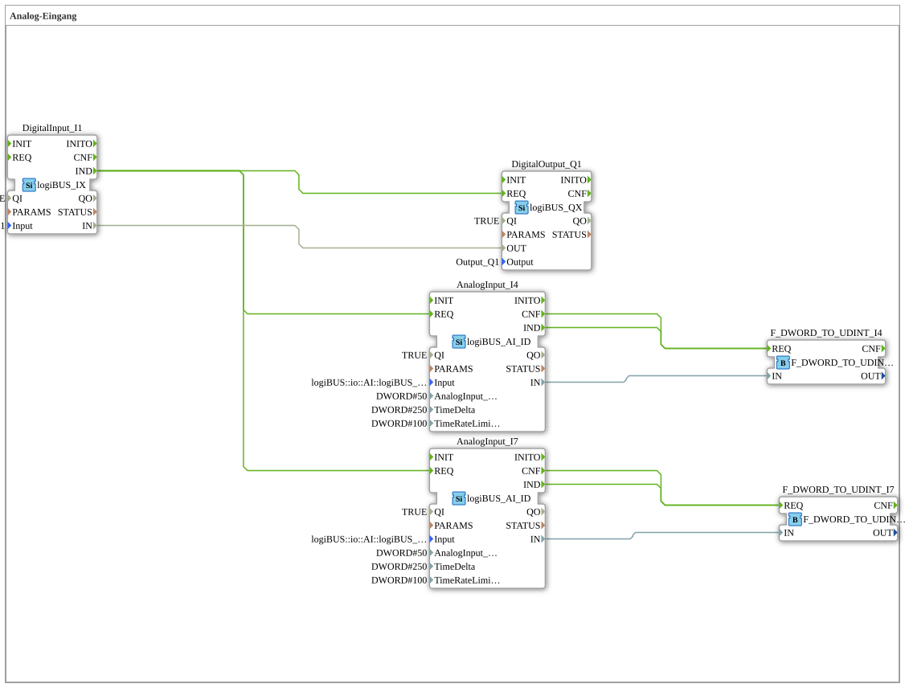

# Exercise_028: Analog Input

This article describes the logiBUS® exercise `Uebung_028`. Here, we move beyond the digital world (on/off) and acquire continuous measured values (analog signals).
----
## Objective of the Exercise

Using the function block `logiBUS_AI_ID`. It demonstrates how analog voltage values (e.g., from a potentiometer or sensor) are read, filtered (hysteresis), and converted.

-----

## Description and Components

[cite_start]The sub-application `Uebung_028.SUB` reads two analog channels from the hardware[cite: 1].

### Function Blocks (FBs)

* **`AnalogInput_I4` & `I7`**: Type `logiBUS_AI_ID`. [cite_start]These blocks represent the analog hardware inputs. They convert the electrical voltage into a numerical digital value.[cite: 1]
* **Parameter `AnalogInput_hysteresis`**: Determines how much the value must change before a new event (`IND`) is triggered (here, 50 units). This suppresses noise.
* **`F_DWORD_TO_UDINT`**: Converts the raw value into an integer data type for further processing.
* -----

## Functionality

The analog module offers two query options:

1. **Event-driven**: As soon as the input voltage changes significantly (outside the hysteresis range), the module automatically sends a `IND` event.
2. **Manual (Polling)**: In this exercise, the digital button `I1` additionally triggers the `REQ` input of the analog module. This forces an immediate update of the values, regardless of whether they have changed or not.

----

## Application Example

**Fuel Level Indicator**:

A float sensor in the tank provides an analog voltage. The controller reads this value. The hysteresis prevents the display from constantly flickering due to slight fluctuations in the fuel level. The user can press a button on the control panel at any time to immediately query the current value.