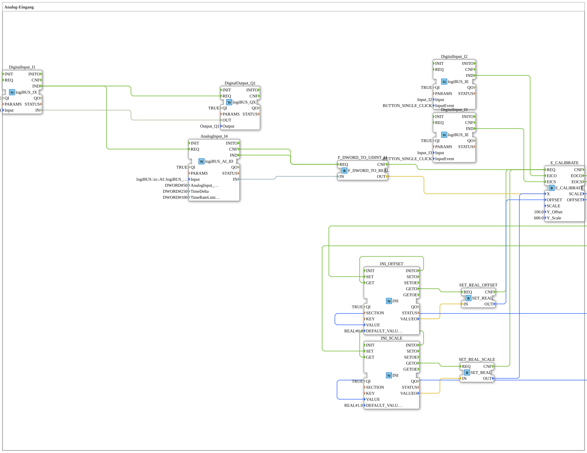

# Exercise_028a: Analog Input



* * * * * * * * * *

## Introduction

This exercise demonstrates the processing of an analog input signal with calibration. Digital pushbuttons are used to calibrate the offset and scaling, and the determined calibration parameters are stored non-volatilely. The exercise shows how to work with analog input blocks, type conversion, calibration functions, and memory blocks in the 4diac IDE.

## Function Blocks (FBs) Used

- **DigitalOutput_Q1** (logiBUS_QX): Digital output Q1.

- **DigitalInput_I1** (logiBUS_IX): Digital input I1.

- **AnalogInput_I4** (logiBUS_AI_ID): Analog input I4.

- Parameters: AnalogInput_hysteresis = 50, TimeDelta = 250, TimeRateLimit = 100.

- **F_DWORD_TO_UDINT_I4** (F_DWORD_TO_REAL): Converts a DWORD value to REAL.

- **CALIBRATE** (E_CALIBRATE): Calibration block.

- Parameters: Y_Offset = 100.0, Y_Scale = 600.0.

- **DigitalInput_I2** (logiBUS_IE): Digital input I2 with BUTTON_SINGLE_CLICK event – serves as a button for offset calibration.

- **DigitalInput_I3** (logiBUS_IE): Digital input I3 with BUTTON_SINGLE_CLICK event – serves as a button for scaling calibration.

- **INI_OFFSET** (INI): Memory block for the offset value.

- Parameter: DEFAULT_VALUE = REAL#0.0.

- **SET_REAL_OFFSET** (SET_REAL): Provides the stored offset value as REAL (initial 0.0).

- **INI_SCALE** (INI): Memory block for the scaling value.

- Parameter: DEFAULT_VALUE = REAL#1.0.

- **SET_REAL_SCALE** (SET_REAL): Provides the stored scaling value as REAL (initial 1.0).

## Program Flow and Connections

The flow is controlled by events:

1. **DigitalInput_I1** sends a `IND` event when activated. This simultaneously triggers the digital output **DigitalOutput_Q1** (via `REQ`) and starts the analog input **AnalogInput_I4** (via `REQ`).

2. **AnalogInput_I4** detects an analog value and outputs it as a DWORD at its output `IN`. At the same time, a `IND` event is sent, which activates the conversion block **F_DWORD_TO_UDINT_I4**.

3. **F_DWORD_TO_UDINT_I4** converts the DWORD value to REAL and passes the result to the calibration block **CALIBRATE** via its input `X`.


4. The user can manually trigger calibration:

- **DigitalInput_I2** (button) sends a `IND` event to `EICO` from **CALIBRATE** → triggers offset calibration.

- **DigitalInput_I3** (button) sends a `IND` event to `EICS` from **CALIBRATE** → triggers scaling calibration.

5. **CALIBRATE** calculates the corrected value from the raw value and the current calibration parameters (offset and scaling). The new parameters are output at `OFFSET` and `SCALE`.

6. These new parameters are written to the memory blocks **INI_OFFSET** and **INI_SCALE** via data connections (event `SET` is sent by **CALIBRATE** via `EOCO` and `EOCS`, respectively).

7. After initialization (`INITO` → `GET`), the stored values are passed back to **CALIBRATE** via **SET_REAL_OFFSET** and **SET_REAL_SCALE**, thus ensuring the calibration is permanently maintained.


``` The data flows connect:

- `AnalogInput_I4.IN` → `F_DWORD_TO_UDINT_I4.IN`
- `F_DWORD_TO_UDINT_I4.OUT` → `CALIBRATE.X`
- `INI_OFFSET.VALUEO` → `SET_REAL_OFFSET.IN` → `SET_REAL_OFFSET.OUT` → `CALIBRATE.OFFSET`
- `INI_SCALE.VALUEO` → `SET_REAL_SCALE.IN` → `SET_REAL_SCALE.OUT` → `CALIBRATE.SCALE`
- Write back: `CALIBRATE.OFFSET` → `INI_OFFSET.VALUE` `CALIBRATE.SCALE` → `INI_SCALE.VALUE`

## Summary

This exercise teaches how to work with analog inputs, their type conversion, and how to implement user-controlled calibration. The calibration parameters (offset and scaling) are stored in non-volatile memory and can be adjusted using pushbuttons. The example code demonstrates how event and data flows can be structured in a sub-app to achieve robust and repeatable analog data acquisition.

---

### 🌐 Related topic subpages on ms-muc-docs.de

* [🌐 Eclipse 4diac IDE & color reference on ms-muc-docs.de ](https://www.ms-muc-docs.de/iec-61499/eclipse-4diac/)


```