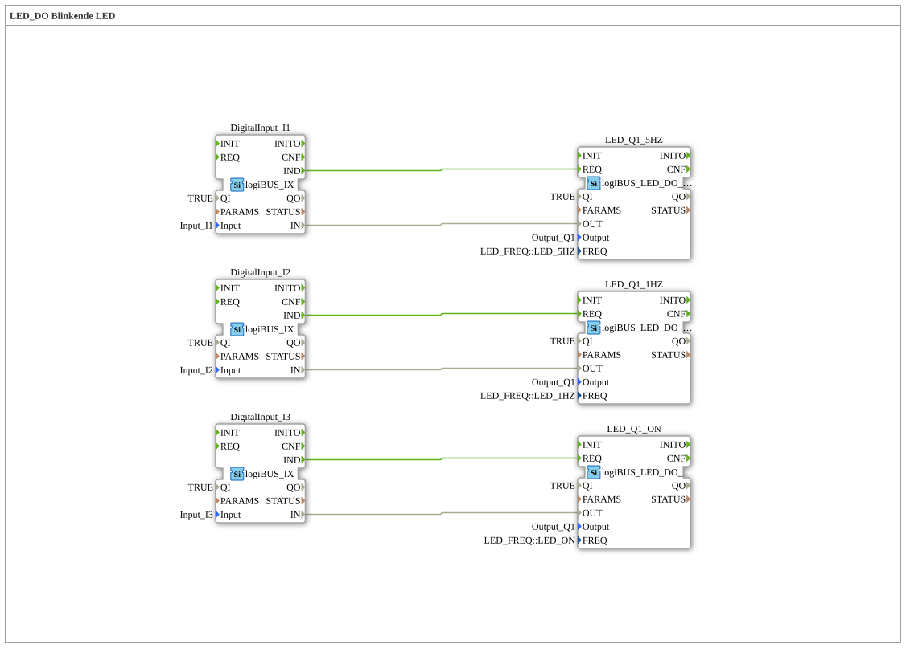

# Exercise_029: LED_DO Flashing LED

[(https://notebooklm.google.com/notebook/a6872e59-1dfc-4132-a118-aff1bc7bc944)
This article describes the logiBUS® exercise `Uebung_029`. It introduces a specialized function block for controlling status LEDs, which handles the flashing at a low hardware level
----

## Objective of the Exercise

Using the function block `logiBUS_LED_DO_QX`. It demonstrates how to operate an LED in different modes (steady light, slow flashing, fast flashing) without having to program complex software timers or flashing logic (as in Exercise 007).

-----

## Description and Components

[cite_start]In `Uebung_029.SUB`, three pushbuttons are used to control a single LED (`Q1`) in three different modes[cite: 1].

### Function Blocks (FBs)

- **`logiBUS_LED_DO_QX`**: A specialized output block. It has the parameter `FREQ` (frequency).
- **Parameter `FREQ`**:
- `LED_ON`: Continuous illumination.
- `LED_1HZ`: Slow blinking (once per second).
- `LED_5HZ`: Rapid flashing (5 times per second).

-----

## Functionality

Although all three blocks in the diagram refer to the same physical output `Output_Q1`, they differ in their configuration:

- Pressing **Button I1** ➡️ Triggers the 5Hz block. The LED flashes very rapidly.
- Pressing **Button I2** ➡️ Triggers the 1Hz block. The LED flashes steadily.
- Pressing **Button I3** ➡️ Triggers the ON block. The LED remains lit.

The flashing frequency is generated directly by the controller's hardware driver, thus reducing the load on the processor.

-----

## Application Example

**Machine Status Signaling**:

- **LED On**: Machine is ready.
- **LED 1Hz**: Machine operating (automatic mode).
- **LED 5Hz**: Warning or malfunction (attention required).

This enables intuitive communication with the operator via a single indicator light.
