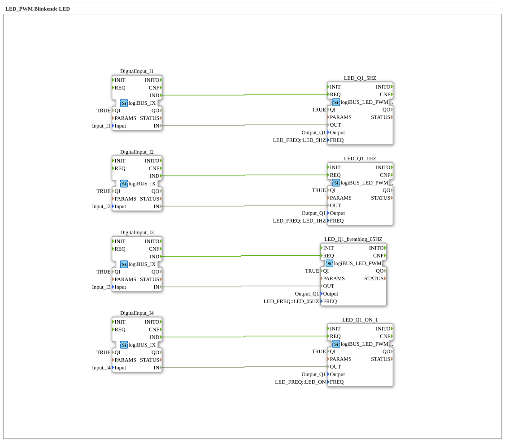

# Exercise_030: LED_PWM Flashing LED
[](https://notebooklm.google.com/notebook/a6872e59-1dfc-4132-a118-aff1bc7bc944)
This article describes the logiBUS® exercise `Uebung_030`. It demonstrates the advanced capabilities of LED control using pulse width modulation (PWM).
```
## 🎧 Podcast


* [3000 Watt Lie: The TVS Diode Decoded] ](https://podcasters.spotify.com/pod/show/ms-muc-lama/episodes/3000-Watt-Lge-Die-TVS-Diode-entschlsselt-e3aun8t)
* [The BTS7030-2EPA Intelligent Car Power Monitor] ](https://podcasters.spotify.com/pod/show/ms-muc-lama/episodes/Der-BTS7030-2EPA-intelligenter-Auto-Stromwchter-e3b8n3s)
* [The Intelligent Circuit Breaker: How the Infineon BTS7030 Replaces Relays and Fuses in Cars] ](https://podcasters.spotify.com/pod/show/ms-muc-lama/episodes/Der-Intelligente-Leistungsschalter-Wie-der-Infineon-BTS7030-Relais-und-Sicherungen-im-Auto-ersetzt-e39av14)
* [Infineon BTS7030-2EPA: Intelligent High-Side Circuit Breaker] ](https://podcasters.spotify.com/pod/show/ms-muc-lama/episodes/Infineon-BTS7030-2EPA-Intelligenter-High-Side-Leistungsschalter-e368fl3)

----

## Objective of the Exercise

Using the building block `logiBUS_LED_PWM_QX`. This demonstrates how to create soft lighting effects (pulsing/"breathing") by controlling the LED brightness via hardware PWM.

-----

## Description and Components

[cite_start]In `Uebung_030.SUB`, four pushbuttons are used to trigger various PWM effects on an LED (`Q1`)[cite: 1].

### Function Blocks (FBs)
* **`logiBUS_LED_PWM_QX`**: This block uses the PWM hardware to display not only ON/OFF, but also brightness gradients.
* **Parameter `FREQ`**:
* `LED_05HZ`: A very slow "breathing" effect (pulsing of brightness).
* `LED_1HZ` & `LED_5HZ`: Classic blinking frequencies.
* `LED_ON`: Constant brightness (100%).

-----

## Functionality

Each button activates a different instance of the PWM module, all of which affect the same physical output `Output_Q1`.

* **Button I3** ➡️ Activates the 0.5 Hz breathing effect. The LED gradually brightens and dims.
* **Buttons I1 & I2** ➡️ Activate fast or slow flashing.
* **Button I4** ➡️ Switches the LED to continuous light.

-----

## Application Example

**High-Quality Status Indicator**:

Instead of harsh flashing, a gentle pulsing of the LED is used to indicate a "standby" state or a running, non-critical background process. This appears more modern and less intrusive for the user.

---

### 🌐 Related topic subpages on ms-muc-docs.de
* [🌐 Diode & Semiconductor Basics on ms-muc-docs.de](https://www.ms-muc-docs.de/elektrotechnik/elektronik-i/diode/diode/)
* [🌐 The PWM Signal & Infographic on ms-muc-docs.de](https://www.ms-muc-docs.de/automatisierung/das-pwm-signal-die-kunst-spannung-zu-zerhacken/das-pwm-signal-die-kunst-spannung-zu-zerhacken-website/)

]
