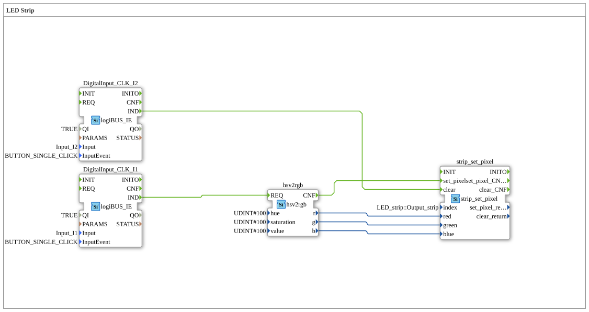

# Exercise_031: LED Strip

This article describes the logiBUS® exercise `Uebung_031`. Here, we control addressable RGB LEDs (e.g., WS2812) using the convenient HSV color model.
## 🎧 Podcast

* [The three timers of DIN EN 61131-3 decoded – TP, TON & TOF explained precisely](https://podcasters.spotify.com/pod/show/iec-61499-grundkurs-de/episodes/Die-drei-Timer-der-DIN-EN-61131-3-entschlsselt--TP--TON--TOF-przise-erklrt-e3dma77)
* [DIN EN 61131-3 vs. 61499-1: Your guide through the standards of industrial automation](https://podcasters.spotify.com/pod/show/iec-61499-grundkurs-de/episodes/DIN-EN-61131-3-vs--61499-1-Dein-Wegweiser-durch-die-Normen-der-Industrieautomatisierung-e36c6nc)
* [DIN EN 61131-3: The heart of agricultural and construction machinery mechatronics and the leap into the future with OB](https://podcasters.spotify.com/pod/show/iec-61499-grundkurs-de/episodes/DIN-EN-61131-3-Das-Herz-der-Land--und-Baumaschinen-Mechatronik-und-der-Sprung-in-die-Zukunft-mit-Ob-e36c2mp)
* [FB_TOF and E_TOF: Delay timers in IEC 61131-3 and 61499](https://podcasters.spotify.com/pod/show/iec-61499-grundkurs-de/episodes/FB_TOF-und-E_TOF-Verzgerungstimer-in-IEC-61131-3-und-61499-e368e2d)
* [IEC 61499 vs. 61131: Do we need a new standard for IIoT? Analysis of a Heated Debate on Distributed Intelligence](https://podcasters.spotify.com/pod/show/iec-61499-grundkurs-de/episodes/IEC-61499-vs--61131-Brauchen-wir-einen-neuen-Standard-fr-IIoT--Analyse-einer-hitzigen-Debatte-um-Verteilte-Intelligenz-e3ahc2r)

----

Using the RGB library for the ESP32. This demonstrates how to define colors not using red-green-blue (RGB) values, but rather using hue, saturation, and value, and how to send these values to an LED strip.

-----

## Ziel der Übung
## Description and Components

[cite_start]The subapplication `Uebung_031.SUB` uses a conversion module and a strip driver[cite: 1].

### Function Blocks (FBs)
* **`hsv2rgb`**: Converts the intuitive HSV values into the RGB values required by the hardware.

* **`I1` (Set)**: Clicking this triggers the setting of the color.
* **`I2` (Clear)**: Clicking this clears the display (LED off).

-----

## Functionality

1. The user clicks on **I1**. This event triggers the conversion.

2. The `hsv2rgb` block takes the preset values (e.g., Hue=100) and provides the proportions for red, green, and blue.

3. The converter's `CNF` event starts the hardware transfer via `strip_set_pixel`.

4. The first LED on the strip illuminates in the selected color.

-----

**Custom Design Lighting**:

The ambient lighting in a cabin should be adjustable. A rotary knob (potentiometer) is used to change the `Hue` value. The program continuously recalculates this value, allowing the driver to navigate smoothly through the entire color spectrum.

---

* [🌐 ESP32 & ESP32-S3 DevKit on ms-muc-docs.de ](https://www.ms-muc-docs.de/elektrotechnik/mikroelektronik/esp32/esp32-s3-devkit/)

## Anwendungsbeispiel
### 🌐 Passende Themen-Unterseiten auf ms-muc-docs.de