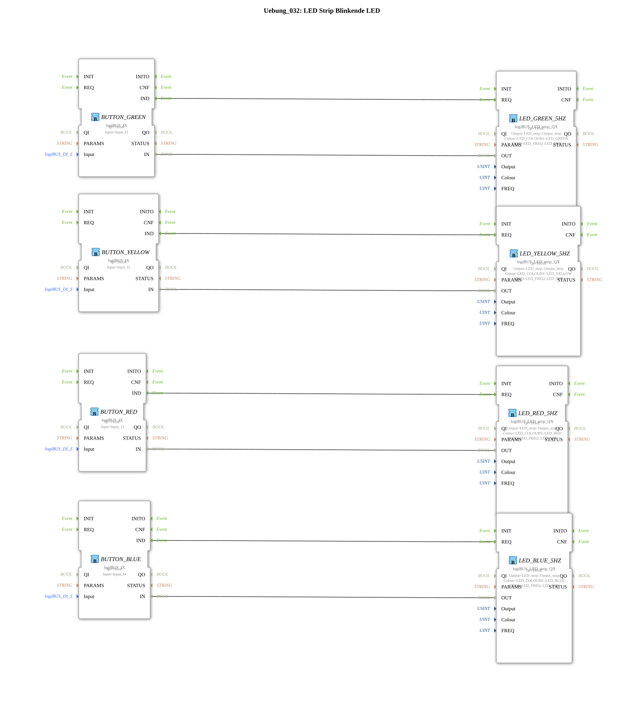

# Exercise_032: LED Strip Flashing LED
[](https://notebooklm.google.com/notebook/a6872e59-1dfc-4132-a118-aff1bc7bc944)
This article describes the logiBUS® exercise `Uebung_032`. It uses pre-configured color blocks for LED strips.
``` ## 📺 Video


* [The ESP32-S3-DevKitC-1](https://www.youtube.com/watch?v=fyQt3THIQEQ)

## 🎧 Podcast
* [ESP32 as an Industrial PLC: Revolution with Eclipse 4diac and logiBUS®](https://podcasters.spotify.com/pod/show/logibus/episodes/ESP32-als-Industrie-SPS-Revolution-mit-Eclipse-4diac-und-logiBUS-e375dp6)
* [ESP32 as PLC: Democratizing Industrial Automation with Eclipse 4diac](https://podcasters.spotify.com/pod/show/logibus/episodes/ESP32-as-PLC-Democratizing-Industrial-Automation-with-Eclipse-4diac-e375e13)
* [ESP32 becomes an industrial PLC for agricultural machinery](https://podcasters.spotify.com/pod/show/logibus/episodes/ESP32-wird-industrielle-SPS-fr-Landmaschinen-e3bf4om)
* [ESP32-S3 Development Boards ESP32-S3-DevKitC-1](https://podcasters.spotify.com/pod/show/ms-muc-lama/episodes/ESP32-S3-Entwicklungsplatinen-ESP32-S3-DevKitC-1-e368gmd)
* [ESP32-S3 in Detail: Dual-Core, 32MB Power and CAN Bus for Agricultural and Construction Machinery Mechatronics ](https://podcasters.spotify.com/pod/show/ms-muc-lama/episodes/ESP32-S3-im-Detail-Dual-Core--32MB-Power-und-CAN-Bus-fr-Land--und-Baumaschinen-Mechatronik-e39haf4)

----

## Exercise Objective

Using the function block `logiBUS_LED_strip_QX`. This is a high-level function block that combines color, frequency, and hardware connectivity for RGB strips in a single block.

-----

## Description and Components

[cite_start]In `Uebung_032.SUB`, four different colors (green, yellow, red, blue) are mapped to four pushbuttons[cite: 1].

### Function Blocks (FBs)
* **`logiBUS_LED_strip_QX`**: Combination function block for RGB strips.
* **Parameters**:
* `Colour`: Selection from a palette (e.g., `LED_RED`).
* `FREQ`: Flashing frequency (here, a uniform 5 Hz).

-----

## Functionality

Each button activates "its" color on the strip. Since all components are configured to the parameter `Output_strip` (channel 0), they override each other.

* Pressing **Green** ➡️ Strip flashes green rapidly.
* Pressing **Red** ➡️ Strip immediately switches to rapid red flashing.

This enables very fast programming of colored status signals.

* ---

### 🌐 Related topic subpages on ms-muc-docs.de
* [🌐 Eclipse 4diac IDE & Color Reference on ms-muc-docs.de](https://www.ms-muc-docs.de/iec-61499/eclipse-4diac/)
* [🌐 ESP32 & ESP32-S3 DevKit on ms-muc-docs.de](https://www.ms-muc-docs.de/elektrotechnik/mikroelektronik/esp32/esp32-s3-devkit/)

]