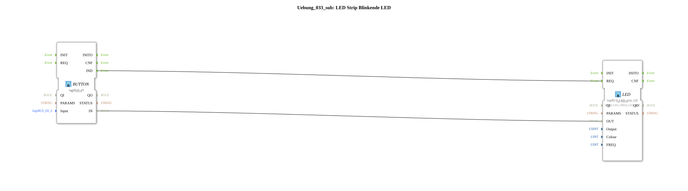

# Exercise_033_sub: LED Strip Flashing LED

[(https://notebooklm.google.com/notebook/a6872e59-1dfc-4132-a118-aff1bc7bc944)
This article describes the sub-app type `Uebung_033_sub`. It serves as a reusable module for controlling colored LED displays.
----
## Overview

[cite_start]This block combines a digital input block (`IX`) and a specialized RGB strip output (`logiBUS_LED_strip_QX`)[cite: 1].

It provides parameters for selecting the input button (`Input`), the color (`Colour`), and the output channel (`Output`). Internally, it is preset to a fixed blinking frequency of 1 Hz. By encapsulating this complex driver logic, colored status indicators can be easily implemented in projects through parameterization instead of complex individual wiring.

## 🛠️ Related Exercises

- [Exercise_033](Uebung_033.md)
