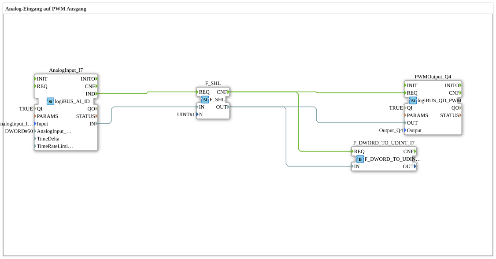

# Exercise_034: Analog Input to PWM Output

[(https://notebooklm.google.com/notebook/a6872e59-1dfc-4132-a118-aff1bc7bc944)
This article describes the logiBUS® exercise `Uebung_034`. Here, an analog measurement is used to continuously control the power of an actuator.
----
## Objective of the Exercise

Connecting an analog input (`logiBUS_AI`) to a PWM output (`logiBUS_QD_PWM`). It demonstrates how data values are scaled to map the control range of a sensor to the power range of an actuator.

-----

## Description and Components

[cite_start]The subapplication `Uebung_034.SUB` reads a potentiometer and uses it to control the brightness of a lamp or the speed of a motor[cite: 1].

### Function Blocks (FBs)

- **`AnalogInput_I7`**: Reads the voltage at the input.
- **`F_SHL`**: A shift register (Shift Left). [cite_start]It is used here for scaling by shifting the input value one bit to the left (corresponding to multiplication by 2)[cite: 1].
- **`PWMOutput_Q4`**: A pulse-width modulated output for power control.

-----

## Functionality

1. Any change at the analog input `I7` triggers a `IND` event.
2. The value is adjusted in `F_SHL` to reach the desired target range.
3. The result is sent to the `OUT` port of the PWM module and activated via `REQ`.
4. The actuator at `Q4` reacts immediately to the new input.

-----

## Application Example

**Light Dimmer or Fan Control**:

By turning a physical potentiometer (`I7`), the operator can continuously adjust the brightness of the cabin lighting or the speed of a fan (`Q4`). The software ensures latency-free transmission of the control commands.

--

### 🌐 Related topic subpages on ms-muc-docs.de

- [🌐 The PWM Signal & Infographic on ms-muc-docs.de](https://www.ms-muc-docs.de/automatisierung/das-pwm-signal-die-kunst-spannung-zu-zerhacken/das-pwm-signal-die-kunst-spannung-zu-zerhacken-website/)
