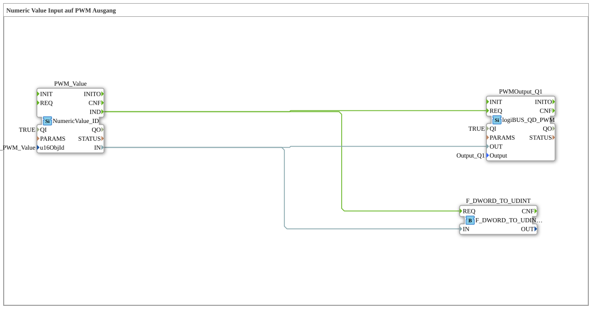

# Exercise_034a1_Q1: Numeric Value Input to PWM Output
[](https://notebooklm.google.com/notebook/a6872e59-1dfc-4132-a118-aff1bc7bc944)
## Overview
[cite_start]In this exercise, a numeric value is read directly from the ISOBUS terminal to control the duty cycle of a PWM output (`Q1`)[cite: 1].
The operator can enter a number on the screen using the object `InputNumber_PWM_Value`. Only after confirmation with "OK" is the event `IND` triggered and the new value transmitted to the PWM hardware. This allows for precise manual setting of parameters (e.g., fan speed or lamp brightness) directly via the display.

``` 

---

### 🌐 Related topic subpages on ms-muc-docs.de
* [🌐 The PWM signal & infographic on ms-muc-docs.de](https://www.ms-muc-docs.de/automatisierung/das-pwm-signal-die-kunst-spannung-zu-zerhacken/das-pwm-signal-die-kunst-spannung-zu-zerhacken-website/)

]
