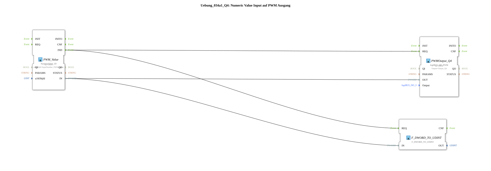

# Exercise_034a1_Q4: Numeric Value Input to PWM Output

[(https://notebooklm.google.com/notebook/a6872e59-1dfc-4132-a118-aff1bc7bc944)

## Overview

[cite_start]Variant of Exercise 034a1_Q1, configured for the hardware output `Q4`[cite: 1].

---

### 🌐 Related topic subpages on ms-muc-docs.de

- [🌐 The PWM signal & infographic on ms-muc-docs.de](https://www.ms-muc-docs.de/automatisierung/das-pwm-signal-die-kunst-spannung-zu-zerhacken/das-pwm-signal-die-kunst-spannung-zu-zerhacken-website/)
